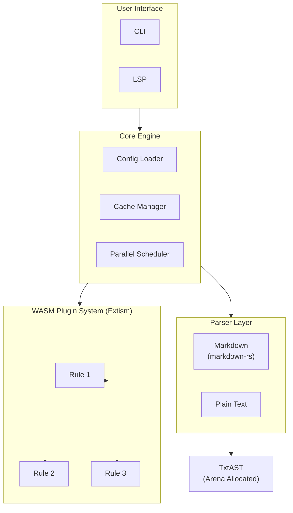

# Texide

[](https://opensource.org/licenses/MIT)
[](https://www.rust-lang.org)

> A high-performance natural language linter written in Rust, inspired by [textlint](https://textlint.github.io/).

## Goals

- **Zero Node.js dependency** - Single binary, no runtime required
- **High performance** - Parallel processing, efficient caching, Arena allocation
- **WASM-based rules** - Write rules in Rust or AssemblyScript, compile to WASM
- **textlint compatibility** - Similar configuration format and rule concepts

## Installation

```bash
# From source
cargo install texide

# Or download pre-built binary from releases
```

## Quick Start

```bash
# Initialize configuration
texide init

# Lint files
texide lint "**/*.md"

# Lint with auto-fix
texide lint --fix "**/*.md"
```

## Configuration

Create `.texide.json` in your project root:

```json
{
  "rules": {
    "no-todo": true,
    "max-lines": {
      "max": 300
    }
  }
}
```

## Creating Custom Rules

```bash
# Create a new rule project
texide create-rule my-custom-rule
cd my-custom-rule

# Build WASM
cargo build --target wasm32-wasip1 --release

# Add to your project
texide add-rule ./target/wasm32-wasip1/release/my_custom_rule.wasm
```

See [Rule Development Guide](./docs/rule-development.md) for details.

## Architecture



## Documentation

- [Rule Development Guide](./docs/rule-development.md)
- [Migration Guide from textlint](./docs/migration-guide.md)
- [Architecture](./docs/architecture.md)
- [Contributing](./CONTRIBUTING.md)

## Contributing

Contributions are welcome! Please read our [Contributing Guide](./CONTRIBUTING.md) first.

### Development Setup

```bash
# Clone the repository
git clone https://github.com/simorgh3196/texide.git
cd texide

# Build
cargo build

# Run tests
cargo test

# Run linter on test fixtures
cargo run --bin texide -- lint tests/fixtures/
```

## License

MIT License - see [LICENSE](./LICENSE) for details.

## Acknowledgements

- [textlint](https://textlint.github.io/) - The original natural language linter
- [Biome](https://biomejs.dev/) - Inspiration for linter architecture
- [Oxc](https://oxc-project.github.io/) - Inspiration for AST and performance
- [Extism](https://extism.org/) - WASM plugin system
