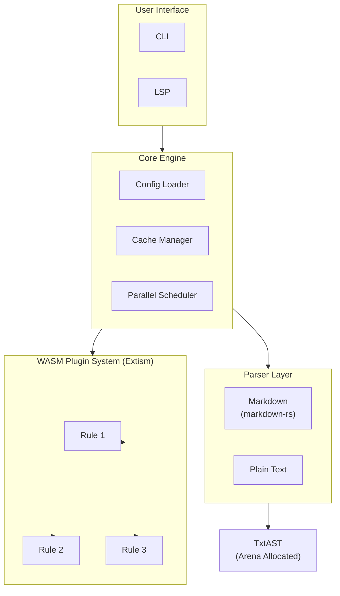

# Texide

[](https://opensource.org/licenses/MIT)
[](https://www.rust-lang.org)
[](https://github.com/simorgh3196/texide/actions/workflows/ci.yml)

> [!WARNING]
> **Research-only / WIP (Work In Progress)**
>
> This project is currently in early research & development stage.
> APIs and configuration formats may change without notice. Not ready for production use.
>
> 現在、研究開発段階のプロジェクトです。実用段階ではありません。

> A high-performance natural language linter written in Rust, inspired by [textlint](https://textlint.github.io/).

## Goals

- **Zero Node.js dependency** - Single binary, no runtime required
- **High performance** - Parallel processing, efficient caching, Arena allocation
- **WASM-based rules** - Write rules in Rust or AssemblyScript, compile to WASM
- **textlint compatibility** - Similar configuration format and rule concepts

## Installation

Since this project is currently in research phase, please install from source:

```bash
# Clone the repository
git clone https://github.com/simorgh3196/texide.git
cd texide

# Install the binary
cargo install --path crates/texide_cli
```

## Quick Start

```bash
# Initialize configuration
texide init

# Lint files
texide lint "**/*.md"

# Lint with auto-fix
texide lint --fix "**/*.md"

# Lint with performance timings
texide lint --timings "**/*.md"
```

## Try with Sample Rules

Sample rules are included in the `rules/` directory. To try them out:

### 1. Build sample rules

```bash
cd rules
cargo build --target wasm32-wasip1 --release
cd ..
```

This builds the following sample rules:
- **no-todo** - Detects TODO/FIXME/XXX comments
- **sentence-length** - Checks sentence length limits
- **no-doubled-joshi** - Detects doubled Japanese particles (助詞の重複)

Built WASM files are located at `rules/target/wasm32-wasip1/release/`.

### 2. Create configuration

Create `.texide.jsonc` in your project root:

```jsonc
{
  "rules": [
    "owner/texide-rule-my-rule",                                      // From GitHub
    { "github": "owner/texide-rule-my-rule", "as": "my-rule2" },      // From GitHub with custom name
    { "path": "local_rules/my-rule/texide-rule.json", "as": "local-rule" }, // From local file
    { "url": "https://example.com/texide-rule.json", "as": "remote-rule" }  // From remote file
  ],
  "options": {
    "my-rule": { "max": 100 },
    "my-rule2": { "min": 100 },
    "local-rule": {},
    "remote-rule": {}
  }
}
```

#### Rule Loading Logic

Rules are resolved by name. `texide` searches for `.texide.jsonc` in:

1. `.texide/rules/` (in your project)
2. `~/.texide/rules/` (in your user directory)

### 3. Run lint with performance timings

```bash
texide lint --timings "**/*.md"
```

Example output:
```text
Checked 19 files (0 from cache), found 0 issues

Performance Timings:
Rule                           | Duration        | %
-------------------------------+-----------------+-----------
sentence-length                | 26.554126ms     | 33.9%
no-todo                        | 26.099628ms     | 33.3%
no-doubled-joshi               | 25.790751ms     | 32.9%
-------------------------------+-----------------+-----------
Total                          | 78.444505ms
```

## Editor Integration (LSP)

Texide includes a Language Server Protocol (LSP) implementation for real-time diagnostics and fixes in editors like VSCode.

```bash
# Start the LSP server
texide lsp start
```

The server automatically loads configuration from `.texide.jsonc` or similar files in the workspace root.

## Configuration

Create `.texide.jsonc` in your project root:

```json
{
  "rules": [
    "owner/texide-rule-max-lines"
  ],
  "options": {
    "max-lines": {
      "max": 300
    }
  },
  "include": ["**/*.md", "**/*.txt"],
  "exclude": ["**/node_modules/**"],
  "cache": true,
  "cache_dir": ".texide-cache",
  "timings": false
}
```

### Configuration Options

| Option | Type | Default | Description |
|--------|------|---------|-------------|
| `rules` | string[] | `[]` | List of rule names to load |
| `options` | object | `{}` | Rule configurations (name -> enabled/options) |
| `include` | string[] | `[]` | File patterns to include |
| `exclude` | string[] | `[]` | File patterns to exclude |
| `cache` | boolean | `true` | Enable caching for faster re-lints |
| `cache_dir` | string | `.texide-cache` | Cache directory path |
| `timings` | boolean | `false` | Enable performance timing output |

## Creating Custom Rules

```bash
# Create a new rule project
texide rules create -l rust my-custom-rule
cd my-custom-rule

# Build WASM
cargo build --target wasm32-wasip1 --release

# Add to your project
texide rules add ./my-custom-rule/texide-rule.json
```

See [Rule Development Guide](./docs/rule-development.md) for details.

## Architecture



## Documentation

- [Rule Development Guide](./docs/rule-development.md)
- [Migration Guide from textlint](./docs/migration-guide.md)
- [Architecture](./docs/architecture.md)
- [WASM Interface](./docs/wasm-interface.md)
- [Roadmap](./docs/roadmap.md)
- [Contributing](./CONTRIBUTING.md)

## Contributing

Contributions are welcome! Please read our [Contributing Guide](./CONTRIBUTING.md) first.

### Development Setup

```bash
# Clone the repository
git clone https://github.com/simorgh3196/texide.git
cd texide

# Build
make build

# Run tests
make test

# Run linter on test fixtures
make lint
make fmt-check
```

## Agent Skills

```bash
npx skills add anthropics/skills -s doc-coauthoring # doc-skills
npx skills add softaworks/agent-toolkit -s commit-work -s using-git-worktrees # git-skills
npx skills add obra/superpowers -s test-driven-development # tdd-skills
npx skills add ZhangHanDong/rust-skills # rust-skills

# Manual link skills
ln -s ../.agents/skills <agent>/skills
```

## License

MIT License - see [LICENSE](./LICENSE) for details.

## Acknowledgements

- [textlint](https://textlint.github.io/) - The original natural language linter
- [Biome](https://biomejs.dev/) - Inspiration for linter architecture
- [Oxc](https://oxc.rs/) - Inspiration for AST and performance
- [Extism](https://extism.org/) - WASM plugin system
