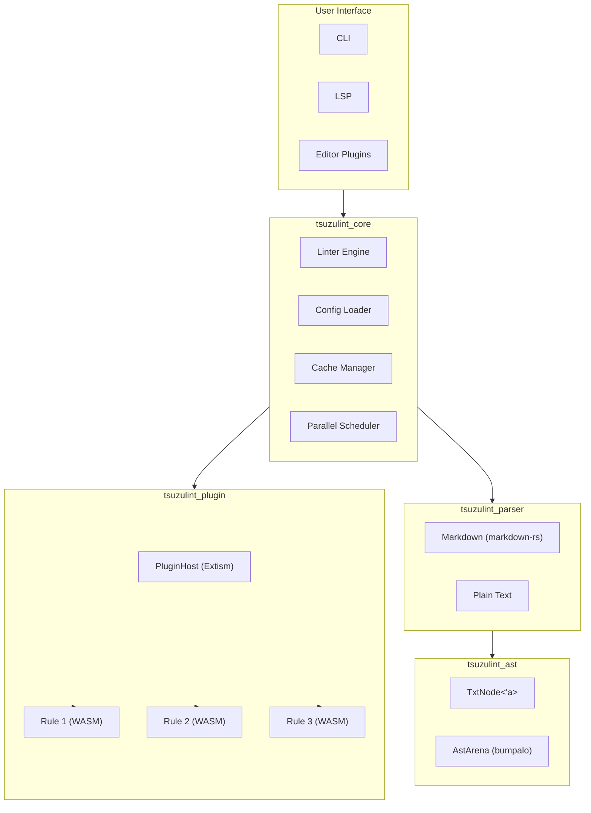
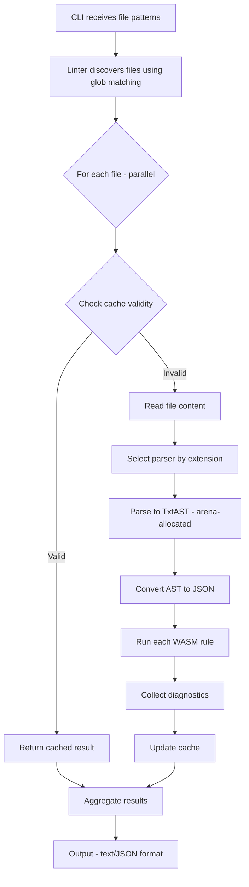
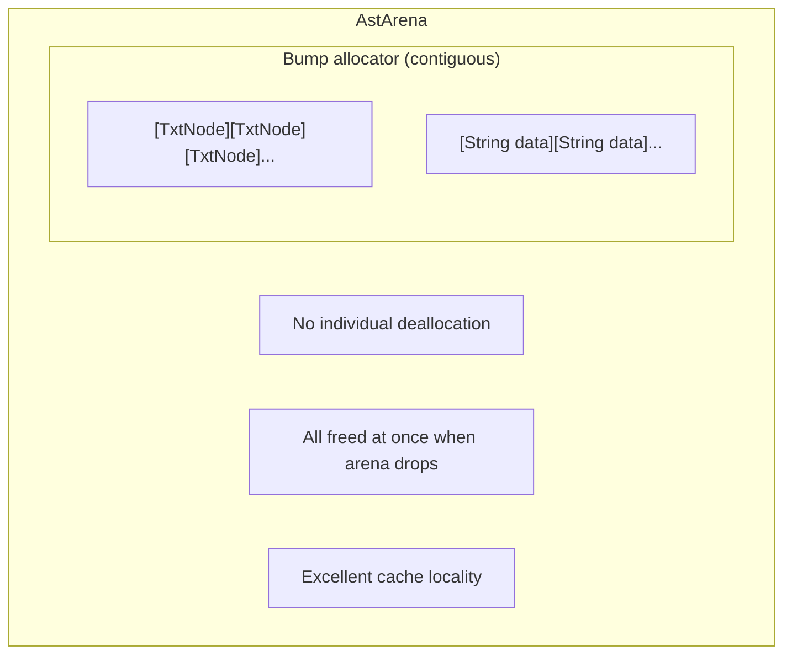
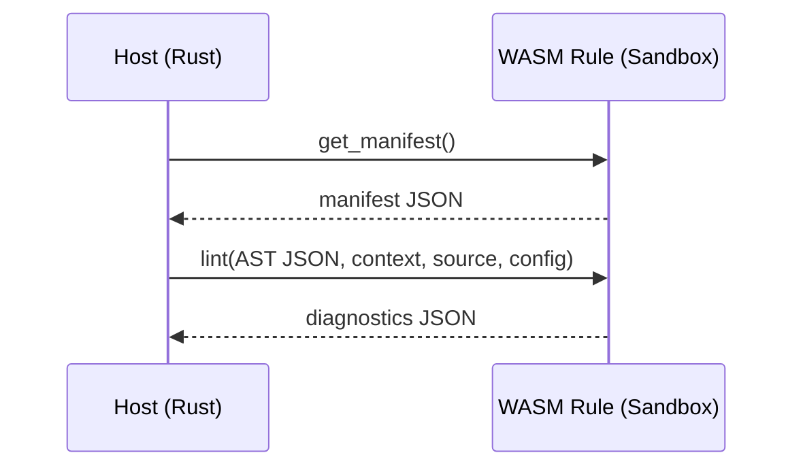

# TsuzuLint Architecture

This document describes the internal architecture of TsuzuLint.

## Overview

## Crates

### tsuzulint_ast

**Purpose**: TxtAST type definitions and memory management.

**Key Components**:
- `TxtNode<'a>`: Arena-allocated AST node
- `AstArena`: bumpalo-based arena allocator
- `NodeType`: Node type enum (Document, Paragraph, Str, etc.)
- `Span`, `Position`: Source location types

**Design Decisions**:
- Uses bumpalo for arena allocation (inspired by Oxc)
- All nodes for a file share one arena
- No `Box`, `Rc`, or `Arc` for child nodes
- Maximizes cache locality

### tsuzulint_parser

**Purpose**: Parse source text into TxtAST.

**Key Components**:
- `Parser` trait: Abstraction for parsers
- `MarkdownParser`: Markdown parser using markdown-rs
- `PlainTextParser`: Simple text parser

**Design Decisions**:
- Uses markdown-rs for mdast output (minimal transform to TxtAST)
- Parser trait enables custom parsers via WASM plugins
- Each parser handles specific file extensions

### tsuzulint_plugin

**Purpose**: WASM plugin system for rules.

**Key Components**:
- `PluginHost`: Extism-based WASM runtime
- `RuleManifest`: Rule metadata
- `Diagnostic`: Lint result with fix information

**Design Decisions**:
- Extism provides sandboxing and multi-language support
- Rules compile to `wasm32-wasip1`
- JSON serialization for host↔plugin communication
- Potential future migration to direct wasmtime use

### tsuzulint_cache

**Purpose**: Cache lint results for unchanged files.

**Key Components**:
- `CacheManager`: File I/O and cache validation
- `CacheEntry`: Cached lint result

**Design Decisions**:
- BLAKE3 for content hashing
- JSON storage (rkyv planned for zero-copy)
- Invalidates on: content change, config change, rule version change

### tsuzulint_core

**Purpose**: Core linter orchestration.

**Key Components**:
- `Linter`: Main linter engine
- `LinterConfig`: Configuration handling
- `LintResult`: Per-file lint result

**Design Decisions**:
- Uses rayon for parallel file processing
- Glob patterns for file discovery
- Integrates parsers, plugins, and cache

### tsuzulint_cli

**Purpose**: Command-line interface.

**Commands**:
- `lint`: Lint files
- `init`: Create config file
- `create-rule`: Generate rule project
- `add-rule`: Register a WASM rule

### tsuzulint_lsp

**Purpose**: Language Server Protocol implementation.

**Status**: 🚧 β版 - Basic implementation (Diagnostics, Code Actions, Symbols) completed.

**Details**: See [LSP Documentation](lsp.md) for more information.

## Data Flow

## Memory Model

## WASM Plugin Interface

## Performance Considerations

1. **Arena Allocation**: Minimizes allocation overhead
2. **Parallel Processing**: rayon for multi-file linting
3. **Caching**: Skip unchanged files
4. **WASM Pre-compilation**: Extism caches compiled modules
5. **Lazy Parsing**: Only parse when cache miss

## Future Enhancements

- [ ] Line-level incremental caching
- [ ] Hot-reload for rules
- [ ] IDE plugin development
- [ ] Rule dependency graph
- [ ] Performance benchmarks vs textlint
