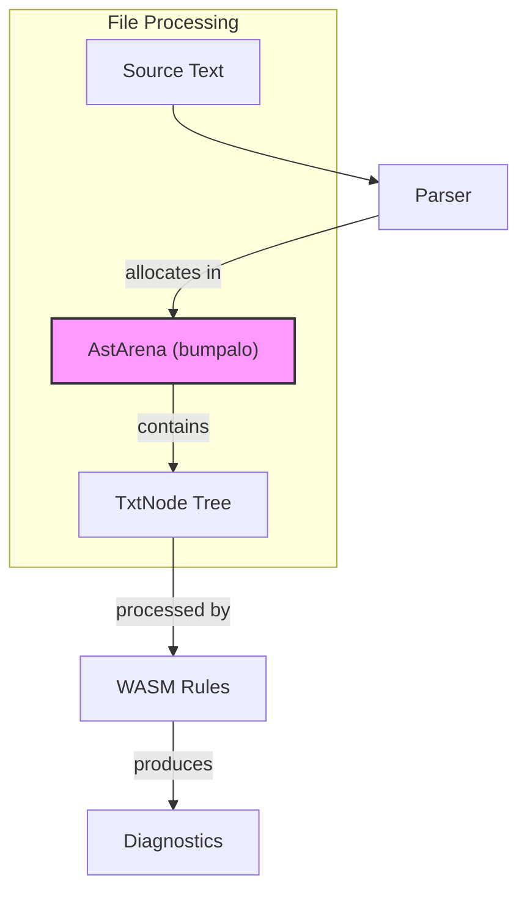

# Arena Allocation in TsuzuLint

This document explains Arena Allocation, a memory management technique used in
TsuzuLint's AST (Abstract Syntax Tree) implementation. It is inspired by the
[Oxc](https://oxc.rs/) project and designed to be understandable for software
engineers who may not be familiar with Rust or systems programming.

## Table of Contents

- [What is Arena Allocation?](#what-is-arena-allocation)
- [Why Use Arena Allocation?](#why-use-arena-allocation)
- [Comparison with Traditional Memory Allocation](#comparison-with-traditional-memory-allocation)
- [Arena Allocation in TsuzuLint](#arena-allocation-in-tsuzulint)
- [How It Works](#how-it-works)
- [Code Examples](#code-examples)
- [Benefits in Practice](#benefits-in-practice)
- [Trade-offs](#trade-offs)
- [References](#references)

---

## What is Arena Allocation?

**Arena Allocation** (also known as "bump allocation" or "region-based
allocation") is a memory management strategy where all objects are allocated
from a single contiguous memory region called an "arena." Instead of allocating
and deallocating memory individually, the entire arena is freed at once when it
is no longer needed.

Think of it like a stack of plates at a buffet:

- **Traditional allocation**: You take one plate, use it, wash it, and put it
  back individually.
- **Arena allocation**: You grab a whole stack of plates, use them throughout
  your meal, and return the entire stack at once when you're done.

---

## Why Use Arena Allocation?

Arena allocation is particularly well-suited for scenarios with these
characteristics:

1. **Many small objects**: When you need to allocate many small objects with
   similar lifetimes
2. **Same lifetime**: When all objects can be freed at the same time
3. **Performance critical**: When allocation overhead needs to be minimized
4. **Tree structures**: When building ASTs or other hierarchical data structures

In TsuzuLint's case, we parse a file into an AST where:

- All nodes are created during parsing
- All nodes live until linting is complete
- The entire tree can be discarded together

This makes arena allocation an ideal choice.

---

## Comparison with Traditional Memory Allocation

### Traditional Heap Allocation

```rust
// Traditional approach using Box (heap allocation)
fn traditional_approach() {
    let node1 = Box::new(Node::new("Hello"));
    let node2 = Box::new(Node::new("World"));
    let node3 = Box::new(Node::new("!"));

    // Each Box allocates separately on the heap
    // Each drop deallocates separately
    // Memory may be scattered across the heap
}
```

**Characteristics:**

- Each allocation requires finding free memory
- Each deallocation requires returning memory to the allocator
- Memory fragmentation can occur
- Individual `Drop` implementations are called
- Higher overhead per allocation

### Arena Allocation

```rust
// Arena-based approach
fn arena_approach() {
    let arena = AstArena::new();

    let node1 = arena.alloc(Node::new("Hello"));
    let node2 = arena.alloc(Node::new("World"));
    let node3 = arena.alloc(Node::new("!"));

    // All nodes allocated in contiguous memory
    // Single deallocation when arena is dropped
}
```

**Characteristics:**

- Allocation is just "bumping" a pointer forward
- No individual deallocation (free everything at once)
- Memory is contiguous (excellent cache locality)
- No `Drop` calls for individual objects
- Minimal overhead per allocation

### Visual Comparison

```text
Traditional Heap Allocation:
┌─────────┐  ┌─────────┐      ┌─────────┐
│ Node A  │  │ Node B  │  ... │ Node C  │  (scattered in memory)
└─────────┘  └─────────┘      └─────────┘
     ↑            ↑                 ↑
   Alloc       Alloc             Alloc
   (slow)      (slow)            (slow)

Arena Allocation:
┌─────────────────────────────────────────┐
│ Node A │ Node B │ Node C │ ... │ free  │  (contiguous)
└─────────────────────────────────────────┘
     ↑
   Bump pointer (just moves forward)
   (fast - O(1))
```

---

## Arena Allocation in TsuzuLint Implementation

TsuzuLint uses the [`bumpalo`](https://docs.rs/bumpalo/) crate for arena allocation.
This is the same approach used by Oxc and other high-performance Rust compiler
projects.

### Architecture Overview



### Key Components

1. **[`AstArena`](crates/tsuzulint_ast/src/arena.rs)**: A wrapper around
   `bumpalo::Bump`
2. **[`TxtNode<'a>`](crates/tsuzulint_ast/src/node.rs)**: AST nodes tied to the
   arena's lifetime
3. **Lifetime parameter `'a`**: Ensures nodes cannot outlive their arena

---

## How It Works

### 1. Creating an Arena

```rust
use tsuzulint_ast::AstArena;

// Create a new arena with default capacity
let arena = AstArena::new();

// Or create with specific initial capacity
let arena = AstArena::with_capacity(1024 * 1024); // 1MB
```

### 2. Allocating Nodes

```rust
// Allocate a single value
let number = arena.alloc(42u32);

// Allocate a string slice
let text = arena.alloc_str("Hello, World!");

// Allocate a slice of values
let numbers = arena.alloc_slice_copy(&[1, 2, 3, 4, 5]);
```

### 3. Building an AST

```rust
use tsuzulint_ast::{AstArena, TxtNode, NodeType, Span};

let arena = AstArena::new();

// Create a text node
let text_node = arena.alloc(TxtNode::new_text(
    NodeType::Str,
    Span::new(0, 5),
    "Hello",
));

// Create children array in the arena
let children = arena.alloc_slice_copy(&[*text_node]);

// Create a parent node with those children
let paragraph = TxtNode::new_parent(
    NodeType::Paragraph,
    Span::new(0, 5),
    children,
);
```

### 4. Lifetime Safety

The `'a` lifetime parameter on `TxtNode<'a>` ensures that nodes cannot outlive
their arena:

```rust
fn parse_document(source: &str) -> TxtNode<'_> {
    let arena = AstArena::new();
    let node = create_node(&arena, source);
    // ERROR: cannot return node because arena is dropped here
    node
}

// Correct approach: caller provides the arena
fn parse_document<'a>(arena: &'a AstArena, source: &str) -> TxtNode<'a> {
    create_node(arena, source)
    // node can be returned because arena outlives this function
}
```

---

## Code Examples

### Example 1: Parser Usage

```rust
use tsuzulint_parser::{MarkdownParser, Parser};
use tsuzulint_ast::AstArena;

// Create arena and parser
let arena = AstArena::new();
let parser = MarkdownParser::new();

let source = "# Hello\n\nThis is a paragraph.";

// Parse into arena-allocated AST
let ast = parser.parse(&arena, source).unwrap();

// The entire AST is in the arena
// When `arena` goes out of scope, everything is freed at once
```

### Example 2: Plain Text Parser

```rust
use tsuzulint_parser::{PlainTextParser, Parser};
use tsuzulint_ast::AstArena;

let arena = AstArena::new();
let parser = PlainTextParser::new();

let source = "First paragraph.\n\nSecond paragraph.";

// Parse text into paragraphs
let ast = parser.parse(&arena, source).unwrap();

// AST structure:
// Document
//   ├── Paragraph
//   │     └── Str: "First paragraph."
//   └── Paragraph
//         └── Str: "Second paragraph."
```

### Example 3: Visitor Pattern with Arena

```rust
use tsuzulint_ast::{Visitor, TxtNode, VisitResult};

struct TextCollector {
    texts: Vec<String>,
}

impl<'a> Visitor<'a> for TextCollector {
    fn visit_str(&mut self, node: &TxtNode<'a>) -> VisitResult {
        if let Some(text) = node.text() {
            self.texts.push(text.to_string());
        }
        VisitResult::Continue
    }
}

// Usage
let arena = AstArena::new();
let ast = parser.parse(&arena, source).unwrap();

let mut collector = TextCollector { texts: Vec::new() };
collector.visit(&ast);
```

---

## Benefits in Practice

### 1. Performance

| Metric | Traditional | Arena | Improvement |
| ------ | ----------- | ----- | ----------- |
| Allocation time | ~50-100ns | ~1-5ns | **10-100x faster** |
| Deallocation time | ~50-100ns per object | ~1ns total | **Massive** |
| Cache locality | Poor (scattered) | Excellent | **Better cache** |
| Memory overhead | High (per allocation) | Low (single) | **Reduced** |

### 2. Cache Locality

Modern CPUs are much faster than memory. When traversing an AST:

```text
Traditional (scattered memory):
CPU → Cache Miss → RAM → Node A
CPU → Cache Miss → RAM → Node B  (different location)
CPU → Cache Miss → RAM → Node C  (different location)

Arena (contiguous memory):
CPU → Cache Miss → RAM → Nodes A, B, C loaded together
CPU → Cache Hit → Node A
CPU → Cache Hit → Node B
CPU → Cache Hit → Node C
```

### 3. Simplified Memory Management

No need to track individual allocations:

```rust
// Traditional: must manage each node's lifetime
let nodes: Vec<Box<TxtNode>> = vec![
    Box::new(node1),
    Box::new(node2),
    // ...
];
// Each Box must be dropped individually

// Arena: one allocation to rule them all
let arena = AstArena::new();
// ... allocate many nodes ...
drop(arena); // Everything freed at once
```

---

## Trade-offs

Arena allocation is not a silver bullet. Consider these limitations:

### 1. No Individual Deallocation

```rust
let arena = AstArena::new();
let temp_data = arena.alloc(large_temporary_data);

// Cannot free temp_data individually
// Must wait until entire arena is dropped
```

**Solution**: Use multiple arenas for different lifetimes, or accept the
temporary memory usage.

### 2. No Drop Implementation

```rust
struct Resource {
    file: File,
}

impl Drop for Resource {
    fn drop(&mut self) {
        let _ = self.file.sync_all();
    }
}

let arena = AstArena::new();
let resource = arena.alloc(Resource { file });

// WARNING: Drop is NOT called when arena is dropped!
```

**Solution**: Only allocate POD (Plain Old Data) types in arenas. For TsuzuLint's
AST, this is fine because nodes are just data.

### 3. Fixed Lifetime

All objects in an arena must have the same lifetime:

```rust
let arena = AstArena::new();
let node_a = create_short_lived_node(&arena);
let node_b = create_long_lived_node(&arena);

// Both nodes live as long as the arena
// Cannot free node_a early while keeping node_b
```

**Solution**: This matches TsuzuLint's use case perfectly - all AST nodes live for
the duration of linting.

---

## References

### Projects Using Arena Allocation

- **[Oxc](https://oxc.rs/)**: JavaScript compiler toolkit using `bumpalo` for
  AST allocation
- **[Biome](https://biomejs.dev/)**: JavaScript toolchain using NodeCache-based
  interning + generational cache
- **[Rust Analyzer](https://rust-analyzer.github.io/)**: Uses rowan red/green
  tree design (structure sharing/RC)
- **[salsa](https://github.com/salsa-rs/salsa)**: Incremental computation
  framework with arena support

### Further Reading

- [bumpalo Documentation](https://docs.rs/bumpalo/)
- [Rust Performance Book: Arena Allocation](https://nnethercote.github.io/perf-book/heap-allocations.html#arena-allocation)
- [Oxc Architecture Discussion](https://github.com/oxc-project/oxc/blob/main/ARCHITECTURE.md)

---

## Summary

Arena allocation in TsuzuLint provides:

1. **Speed**: O(1) allocation by bumping a pointer
2. **Efficiency**: Batch deallocation instead of individual frees
3. **Locality**: Contiguous memory layout for better cache performance
4. **Safety**: Rust's lifetime system prevents use-after-free bugs

This approach is ideal for compiler-like tools where:

- Many small objects are allocated during parsing
- All objects share the same lifetime
- Performance is critical

The trade-offs (no individual deallocation, no Drop) are acceptable for AST
nodes and well-managed through careful API design.
