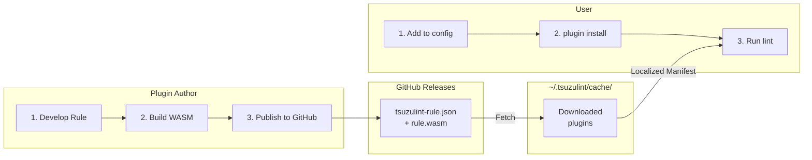
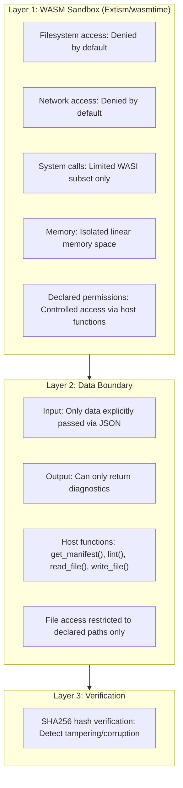
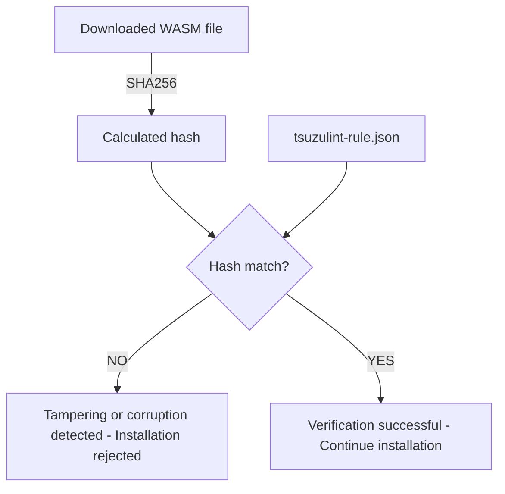

# External Plugin Distribution Guide

> [!IMPORTANT]
> **Beta Feature**: This plugin distribution system is currently in **Beta**.
> The specification described in this document is subject to change.

A guide for installing and managing plugins published on GitHub, as well as a distribution guide for plugin authors.

## Overview

TsuzuLint's plugin system has the following features:

- **GitHub Integration**: Install directly from GitHub Releases using `owner/repo` format
- **Version Management**: Reproducibility through semantic versioning and exact version pinning (owner/repo@1.0.0)
- **Security**: WASM sandbox + hash verification
- **Backward Compatibility**: Continues to support existing local plugin specifications



- **Registry Manifest Rewriting**: When caching a remote plugin, `tsuzulint_registry` detects if `artifacts.wasm` is a URL. If so, it rewrites it to `"rule.wasm"` (the local filename) in the cached manifest.
- **Core Pureness**: `tsuzulint_core` remains network-agnostic. It strictly resolves WASM paths relative to the manifest file. The localization handled by the registry ensures core can always find the rule locally.


---

## Part 1: Plugin User Guide

### 1.1 Installing Plugins

#### Install from CLI

```bash
# GitHub format (latest version)
tzlint plugin install simorgh3196/tsuzulint-rule-no-doubled-joshi

# With version specification
tzlint plugin install simorgh3196/tsuzulint-rule-no-doubled-joshi@1.2.0

# From URL
tzlint plugin install https://example.com/rules/tsuzulint-rule.json
```

**What `plugin install` Does:**

1. If `.tsuzulint.jsonc` doesn't exist, creates it from template with JSON Schema reference
2. Adds rule declaration to the `rules` array
3. Retrieves configuration schema from `get_manifest()` returned manifest
4. Adds all rule options with default values to the `options` section

Example - first install:

```bash
tzlint plugin install simorgh3196/tsuzulint-rule-sentence-length
```

**What happens:**

1. `.tsuzulint.jsonc` is created:

```json
{
  "$schema": "https://raw.githubusercontent.com/simorgh3196/tsuzulint/main/schemas/v1/config.json",
  "rules": [
    "simorgh3196/tsuzulint-rule-sentence-length"
  ],
  "options": {
    "sentence-length": {
      "max": 100,
      "min": 0
    }
  }
}
```

#### Specify in Configuration File

`.tsuzulint.jsonc`:

```json
{
  "rules": [
    "simorgh3196/tsuzulint-rule-no-doubled-joshi",
    "simorgh3196/tsuzulint-rule-sentence-length@1.2.0"
  ],
  "options": {
    "no-doubled-joshi": true,
    "sentence-length": { "max": 100 }
  }
}
```

### 1.2 Plugin Specification Formats

| Format | Example | Description |
| :--- | :--- | :--- |
| GitHub | `"owner/repo"` | Fetch latest release |
| GitHub + version | `"owner/repo@1.0.0"` | Fetch specific version (pinned) |
| GitHub + alias | `{ "github": "owner/repo", "as": "alias" }` | With explicit alias |
| URL | `{ "url": "https://...", "as": "alias" }` | Manifest URL (`as` required) |
| Path | `{ "path": "./local/..." }` | Local manifest (`as` optional) |

> **Note**: Version range specification (e.g., `^1.0`, `~1.0`) is not supported. Use exact versions for reproducibility.
>
> **Note**: For URL sources, the `as` field is required because the owner cannot be determined. For Path sources, `as` is optional; if omitted, the rule name is extracted from the manifest.

### 1.3 Plugin Management Commands

```bash
# List installed plugins
tzlint plugin list

# Example output:
# NAME                                       VERSION  SOURCE
# simorgh3196/tsuzulint-rule-no-doubled-joshi   1.2.3    github
# simorgh3196/tsuzulint-rule-sentence-length    1.0.0    github

# Check for updatable plugins
tzlint plugin list --outdated

# Example output:
# NAME                                    CURRENT  LATEST
# simorgh3196/tsuzulint-rule-no-doubled-joshi  1.2.3    1.3.0

# Update all plugins
tzlint plugin update

# Update specific plugin
tzlint plugin update simorgh3196/tsuzulint-rule-no-doubled-joshi

# Remove plugin
tzlint plugin remove simorgh3196/tsuzulint-rule-no-doubled-joshi
```

### 1.4 Cache and Storage

```text
~/.config/tsuzulint/
├── plugins/                      # Global plugins (manually placed)
│   └── my-local-rule.wasm
├── cache/
│   └── plugins/                  # Download cache
│       └── simorgh3196/
│           └── tsuzulint-crates/
├── tsuzulint_registry/        # Plugin resolution, fetching, and security
│   ├── resolver.rs         # Resolution of GitHub/URL/Local sources
│   ├── source.rs           # Download definitions
│   ├── cache.rs            # Cache management and manifest localization
│   ├── manifest.rs         # Manifest parsing logic
│   ├── hash.rs             # SHA256 integrity verification
│   └── permissions.rs      # Permission validation
└── tsuzulint_manifest/        # Shared manifest definitions and validation
    ├── lib.rs              # ExternalRuleManifest struct and validate_manifest
    └── schemas/v1/rule.json # Embedded JSON Schema
```

To clear the cache:

```bash
tzlint plugin cache clean
```

### 1.5 Configuration File Priority and Rule Conflicts

#### Config File Priority

TsuzuLint supports two configuration file formats. When both exist, `.tsuzulint.jsonc` takes precedence:

1. `.tsuzulint.jsonc` (default, supports comments)
2. `.tsuzulint.json`

#### Rule Identifier and Alias

Each rule has two forms of identification:

- **Short name**: Defined in manifest's `name` field (e.g., `no-todo`, `sentence-length`)
- **Alias**: Explicitly specified via `as` field, or auto-constructed as `{owner}/{name}` for GitHub sources

The manifest only requires the short name:

```json
{
  "rule": {
    "name": "sentence-length",
    ...
  }
}
```

For GitHub sources, TsuzuLint automatically constructs the identifier from the repository owner and the rule name. For URL/Path sources, an explicit alias via `as` is required.

#### Using Aliases

**Basic usage** - No alias needed for simple cases:

```json
{
  "rules": [
    "simorgh3196/tsuzulint-rule-no-todo",
    "alice/tsuzulint-rule-sentence-length"
  ],
  "options": {
    "no-todo": true,
    "sentence-length": { "max": 100 }
  }
}
```

**With explicit alias** - Use `as` to specify a custom identifier:

```json
{
  "rules": [
    { "github": "alice/tsuzulint-rule-sentence-length", "as": "alice-sl" },
    { "path": "./local-rules/my-rule" },
    { "url": "https://example.com/tsuzulint-rule.json", "as": "external" }
  ],
  "options": {
    "alice-sl": { "max": 100 },
    "my-rule": { "enabled": true },
    "external": { "strict": false }
  }
}
```

> **Note**: For `url` sources, the `as` field is **required**. For `path` sources, `as` is optional (if omitted, the rule name is extracted from the manifest).

#### Same-Name Rule Resolution

When multiple rules have the same short name, you **must** use explicit aliases to disambiguate. TsuzuLint will raise an error if conflicting rules are not aliased.

**With conflict** - Use `as` to assign unique aliases:

```json
{
  "rules": [
    { "github": "alice/tsuzulint-rule-sentence-length", "as": "alice-sl" },
    { "github": "bob/tsuzulint-rule-sentence-length", "as": "bob-sl" }
  ],
  "options": {
    "alice-sl": { "max": 100 },
    "bob-sl": { "max": 80 }
  }
}
```

**Resolution priority:**

1. If `as` is specified, use that alias
2. If no conflict exists, use the short name
3. If conflict exists and no `as`, **raise an error**

When a conflict is detected without explicit aliases, TsuzuLint raises an error:

```text
Error: Rule name "sentence-length" is ambiguous (multiple plugins provide this rule):
   - alice/tsuzulint-rule-sentence-length
   - bob/tsuzulint-rule-sentence-length
   Use 'as' to specify unique aliases for each rule.
```

---

## Part 2: Plugin Author Guide

### 2.1 Plugin Spec File (tsuzulint-rule.json)

To distribute a plugin, place `tsuzulint-rule.json` in your repository. Using JSON Schema provides auto-completion, validation, and inline documentation in IDEs.

```json
{
  "$schema": "https://raw.githubusercontent.com/simorgh3196/tsuzulint/main/schemas/v1/rule.json",
  "rule": {
    "name": "no-doubled-joshi",
    "version": "1.0.0",
    "description": "Detects duplicate Japanese particles",
    "repository": "https://github.com/simorgh3196/tsuzulint-rule-no-doubled-joshi",
    "license": "MIT",
    "authors": ["Tomoya Hayakawa <simorgh3196@gmail.com>"],
    "keywords": ["japanese", "grammar", "joshi"]
  },
  "artifacts": {
    "wasm": "https://github.com/simorgh3196/tsuzulint-rule-no-doubled-joshi/releases/download/v{version}/no_doubled_joshi.wasm",
    "sha256": "a1b2c3d4e5f6789..."
  },
  "tsuzulint": {
    "min_version": "0.2.0"
  }
}
```

**DX Benefits:**

- `$schema` enables auto-completion, validation, and hover documentation in VSCode and other IDEs
- Type checking and required field validation on save
- No need to memorize field names or valid values

**Schema Versioning:**

- URL format: `schemas/v{major}/rule.json` (e.g., `schemas/v1/rule.json`)
- Major version increments for backward-incompatible changes (adding required fields, removing fields, etc.)
- Backward-compatible changes (adding optional fields, etc.) are updated within the same version
- Old schema versions are maintained for a period after deprecation

#### Field Descriptions

**[rule] section**

| Field | Required | Description |
| :--- | :--- | :--- |
| `name` | ✓ | Rule ID (`no-doubled-joshi` format) |
| `version` | ✓ | Semantic version |
| `description` | | Description text |
| `repository` | | GitHub repository URL |
| `license` | | License (SPDX format recommended) |
| `authors` | | Author list |
| `keywords` | | Search keywords |

> **Note**: Runtime configuration (`fixable`, `node_types`, `cache_scope`, `exclude_contexts`) is defined in WASM via `get_manifest()`. See [WASM Interface Specification](./wasm-interface.md#rulemanifest).

**[artifacts] section**

| Field | Required | Description |
| :--- | :--- | :--- |
| `wasm` | ✓ | WASM file download URL |
| `sha256` | ✓ | SHA256 hash of WASM file (for tampering/corruption detection) |
| `permissions` | | Filesystem/network permissions (future) |

**permissions** (Future Extension)

| Field | Required | Description |
| :--- | :--- | :--- |
| `filesystem` | | Array of filesystem access declarations |
| `network` | | Array of network access declarations (future, low priority) |

Filesystem permission format:

```json
{
  "permissions": {
    "filesystem": [
      { "path": "~/.tsuzulint/dictionaries/", "access": "read" },
      { "path": "~/.tsuzulint/data/cache.json", "access": "write" }
    ]
  }
}
```

### 2.2 Calculating Hash

Calculate SHA256 hash of WASM file:

```bash
# macOS/Linux
shasum -a 256 my_rule.wasm
# Output: a1b2c3d4e5f6... my_rule.wasm

# Or
openssl dgst -sha256 my_rule.wasm

# TsuzuLint CLI (future implementation)
tzlint plugin hash my_rule.wasm
```

### 2.3 Publishing on GitHub Releases

#### Manual Release

1. Build WASM

   ```bash
   cargo build --target wasm32-wasip1 --release
   ```

2. Calculate hash

   ```bash
   shasum -a 256 target/wasm32-wasip1/release/my_rule.wasm
   ```

3. Update `tsuzulint-rule.json` (set sha256)

4. Create GitHub Release
   - Tag: `v1.0.0`
   - Asset: `my_rule.wasm`

#### Automated Release with GitHub Actions

`.github/workflows/release.yml`:

```yaml
name: Release

on:
  push:
    tags:
      - 'v*'

env:
  CARGO_TERM_COLOR: always

jobs:
  release:
    runs-on: ubuntu-latest
    permissions:
      contents: write

    steps:
      - uses: actions/checkout@v4

      - name: Install Rust
        uses: dtolnay/rust-toolchain@stable
        with:
          targets: wasm32-wasip1

      - name: Build WASM
        run: cargo build --target wasm32-wasip1 --release

      - name: Calculate hash
        id: hash
        run: |
          HASH=$(shasum -a 256 target/wasm32-wasip1/release/*.wasm | cut -d' ' -f1)
          echo "sha256=$HASH" >> $GITHUB_OUTPUT

      - name: Update tsuzulint-rule.json
        run: |
          VERSION=${GITHUB_REF#refs/tags/v}
          jq --arg ver "$VERSION" --arg hash "${{ steps.hash.outputs.sha256 }}" \
            '.rule.version = $ver | .artifacts.sha256 = $hash' \
            tsuzulint-rule.json > tmp.json && mv tmp.json tsuzulint-rule.json

      - name: Create Release
        uses: softprops/action-gh-release@v2
        with:
          files: |
            target/wasm32-wasip1/release/*.wasm
            tsuzulint-rule.json
          generate_release_notes: true
```

### 2.4 Versioning

Follow [Semantic Versioning](https://semver.org/):

- **MAJOR** (1.0.0 → 2.0.0): Backward-incompatible changes
- **MINOR** (1.0.0 → 1.1.0): Backward-compatible feature additions
- **PATCH** (1.0.0 → 1.0.1): Backward-compatible bug fixes

```bash
# Version management with Git tags
git tag v1.0.0
git push origin v1.0.0
```

### 2.5 Directory Structure Example

```text
tsuzulint-rule-no-doubled-joshi/
├── .github/
│   └── workflows/
│       └── release.yml           # Automated release workflow
├── src/
│   └── lib.rs                    # Rule implementation
├── Cargo.toml
├── tsuzulint-rule.json            # Plugin spec (required)
├── README.md
└── LICENSE
```

---

## Part 3: Security

### 3.1 Security Model

TsuzuLint adopts a defense-in-depth approach:



### 3.2 What WASM Sandbox Prevents

| Threat | Defense Status |
| :--- | :--- |
| File reading | ✓ Blocked by default (allowed only for declared paths) |
| File writing | ✓ Blocked by default (allowed only for declared paths) |
| Network communication | ✓ Blocked (future: may allow declared hosts) |
| Environment variable access | ✓ Blocked (no access) |
| Process execution | ✓ Blocked (no access) |
| Memory corruption attacks | ✓ Blocked (isolated memory space) |
| Infinite loops | ✓ Blocked (configurable timeout) |
| Path traversal attacks | ✓ Blocked (path normalization enforced) |

### 3.4 Hash Verification Mechanism



---

## Part 3: Troubleshooting

### Installation Errors

### "Plugin not found"

```text
Error: Plugin 'owner/repo' not found
```

- Verify repository name is correct
- Verify release is published
- Verify `tsuzulint-rule.json` exists in repository

### "Hash mismatch"

```text
Error: SHA256 hash mismatch
  Expected: a1b2c3...
  Actual:   x9y8z7...
```

- Download may have been corrupted → Retry
- Hash in `tsuzulint-rule.json` may be outdated → Report to author
- WASM file may have been tampered with → Verify trusted source

### Runtime Errors

### "Minimum version not satisfied"

```text
Error: Plugin requires TsuzuLint >= 0.3.0, but current version is 0.2.0
```

- Update TsuzuLint: `cargo install tsuzulint`

### Cache Issues

Clear cache and retry:

```bash
tzlint plugin cache clean
tzlint plugin install  # Re-install plugins
```

---

## Part 4: CLI Reference

### TsuzuLint plugin install

```text
tzlint plugin install [OPTIONS] <PLUGIN>

Arguments:
  <PLUGIN>  Plugin specification (owner/repo, owner/repo@version, manifest URL/path)

Options:
  -h, --help       Show help
```

### TsuzuLint plugin list

```text
tzlint plugin list [OPTIONS]

Options:
  --outdated       Show only updatable plugins
  --json           Output in JSON format
  -h, --help       Show help
```

### TsuzuLint plugin update

```text
tzlint plugin update [OPTIONS] [PLUGIN]

Arguments:
  [PLUGIN]  Plugin to update (all if omitted)

Options:
  -h, --help       Show help
```

### TsuzuLint plugin remove

```text
tzlint plugin remove <PLUGIN>

Arguments:
  <PLUGIN>  Plugin name to remove
```

### TsuzuLint plugin verify

```text
tzlint plugin verify [PLUGIN]

Arguments:
  [PLUGIN]  Plugin to verify (all if omitted)
```

### TsuzuLint plugin cache

```text
tzlint plugin cache <COMMAND>

Commands:
  clean    Clear cache
  list     Show cache contents
```

### TsuzuLint plugin hash

```text
tzlint plugin hash <WASM_FILE>

Arguments:
  <WASM_FILE>  WASM file to calculate hash for

Description:
  Calculates SHA256 hash of a WASM file.
  Use this to set the sha256 field in the [artifacts].
```

---

## Related Documentation

- [Rule Development Guide](./rule-development.md) - How to develop rules
- [WASM Interface Specification](./wasm-interface.md) - WASM interface specification
- [Roadmap](./roadmap.md) - Development roadmap
