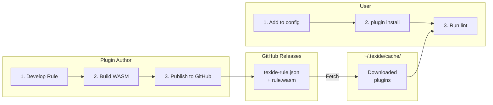
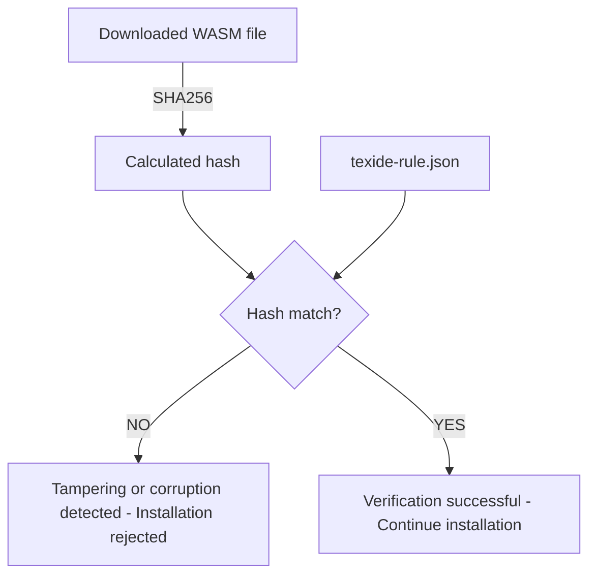

# External Plugin Distribution Guide

> [!WARNING]
> **Not Yet Implemented**: This plugin distribution system is planned but not yet implemented.
> The specification described in this document is subject to change.

A guide for installing and managing plugins published on GitHub, as well as a distribution guide for plugin authors.

## Overview

Texide's plugin system has the following features:

- **GitHub Integration**: Install directly from GitHub Releases using `owner/repo` format
- **Version Management**: Reproducibility through semantic versioning and exact version pinning (owner/repo@1.0.0)
- **Security**: WASM sandbox + hash verification + confirmation UI
- **Backward Compatibility**: Continues to support existing local plugin specifications



---

## Part 1: Plugin User Guide

### 1.1 Installing Plugins

#### Install from CLI

```bash
# GitHub format (latest version)
texide plugin install simorgh3196/texide-rule-no-doubled-joshi

# With version specification
texide plugin install simorgh3196/texide-rule-no-doubled-joshi@1.2.0

# Direct URL specification
texide plugin install https://example.com/rules/texide-rule.json
```

**What `plugin install` Does:**

1. If `.texide.jsonc` doesn't exist, creates it from template with JSON Schema reference
2. Adds plugin declaration to the `plugins` array
3. Retrieves configuration schema from the plugin's manifest (`texide-rule.json`)
4. Adds all plugin options with default values to the `rules` section

Example - first install:
```bash
texide plugin install simorgh3196/texide-rule-sentence-length
```

Generated `.texide.jsonc`:
```json
{
  "$schema": "https://raw.githubusercontent.com/simorgh3196/texide/main/schemas/v1/config.json",
  "plugins": [
    "simorgh3196/texide-rule-sentence-length"
  ],
  "rules": {
    "sentence-length": {
      "max": 100,
      "min": 0
    }
  }
}
```

#### Specify in Configuration File

`.texide.jsonc`:

```json
{
  "plugins": [
    "simorgh3196/texide-rule-no-doubled-joshi",
    "simorgh3196/texide-rule-sentence-length@1.2.0"
  ],
  "rules": {
    "no-doubled-joshi": true,
    "sentence-length": { "max": 100 }
  }
}
```

### 1.2 Plugin Specification Formats

| Format | Example | Description |
|--------|---------|-------------|
| GitHub | `"owner/repo"` | Fetch latest release |
| GitHub + version | `"owner/repo@1.0.0"` | Fetch specific version (pinned) |
| URL | `{ "url": "https://.../texide-rule.json" }` | Manifest URL |
| Path | `{ "path": "./local/texide-rule.json" }` | Local manifest path |

> **Note**: Version range specification (e.g., `^1.0`, `~1.0`) is not supported. Use exact versions for reproducibility.

### 1.3 Plugin Management Commands

```bash
# List installed plugins
texide plugin list

# Example output:
# NAME                                       VERSION  SOURCE
# simorgh3196/texide-rule-no-doubled-joshi   1.2.3    github
# simorgh3196/texide-rule-sentence-length    1.0.0    github

# Check for updatable plugins
texide plugin list --outdated

# Example output:
# NAME                                    CURRENT  LATEST
# simorgh3196/texide-rule-no-doubled-joshi  1.2.3    1.3.0

# Update all plugins
texide plugin update

# Update specific plugin
texide plugin update simorgh3196/texide-rule-no-doubled-joshi

# Remove plugin
texide plugin remove simorgh3196/texide-rule-no-doubled-joshi
```

### 1.4 Cache and Storage

```
~/.texide/
├── plugins/                      # Global plugins (manually placed)
│   └── my-local-rule.wasm
├── cache/
│   └── plugins/                  # Download cache
│       └── simorgh3196/
│           └── texide-rule-no-doubled-joshi/
│               ├── 1.2.3/
│               │   ├── no_doubled_joshi.wasm
│               │   └── texide-rule.json
│               └── 1.2.2/
│                   └── ...
└── trust.json                    # Trusted repository list
```

To clear the cache:

```bash
texide plugin cache clean
```

### 1.5 Security Settings

Configure security policy in `.texide.jsonc`:

```json
{
  "plugin_security": {
    "confirm_install": true,
    "trusted_repositories": [
      "simorgh3196/texide-rule-no-doubled-joshi",
      "simorgh3196/texide-rule-sentence-length"
    ]
  }
}
```

| Option | Default | Description |
|--------|---------|-------------|
| `confirm_install` | `true` | Show confirmation prompt on first install |
| `trusted_repositories` | `[]` | List of trusted repositories |

#### First-time Installation Confirmation

When `confirm_install: true`, new plugins require confirmation:

```
╭──────────────────────────────────────────────────────────────────╮
│ New plugin installation                                          │
├──────────────────────────────────────────────────────────────────┤
│ Plugin: simorgh3196/texide-rule-no-doubled-joshi                 │
│ Version: 1.2.3                                                   │
│ Repository: https://github.com/simorgh3196/texide-rule-no-doubled-joshi │
│ SHA256: a1b2c3d4e5f6...                                          │
│                                                                  │
│ ⚠️  This plugin will run in a WASM sandbox, but you should only  │
│    install plugins from sources you trust.                       │
│                                                                  │
│ [T]rust this repository | [I]nstall once | [C]ancel              │
╰──────────────────────────────────────────────────────────────────╯
```

For plugins requesting additional permissions:

```
╭──────────────────────────────────────────────────────────────────╮
│ New plugin installation                                          │
├──────────────────────────────────────────────────────────────────┤
│ Plugin: simorgh3196/texide-rule-custom-dict                      │
│ Version: 1.0.0                                                   │
│                                                                  │
│ ⚠️  This plugin requests additional permissions:                 │
│                                                                  │
│   📁 Read: ~/.texide/dictionaries/                               │
│   📝 Write: ~/.texide/dictionaries/user-terms.txt                │
│                                                                  │
│ [T]rust this repository | [I]nstall once | [C]ancel              │
╰──────────────────────────────────────────────────────────────────╯
```

- **Trust**: Add this repository to the trust list (skip confirmation in the future)
- **Install once**: Install only this time (confirmation required next time)
- **Cancel**: Cancel installation

For CI/CD, skip with `--yes` flag:

```bash
texide plugin install --yes simorgh3196/texide-rule-foo
```

### 1.6 Configuration File Priority and Rule Conflicts

#### Config File Priority

Texide supports two configuration file formats. When both exist, `.texide.jsonc` takes precedence:

1. `.texide.jsonc` (default, supports comments)
2. `.texide.json`

#### Same-Name Rule Conflict Resolution (First Wins)

When multiple plugins provide rules with the same name, the **first defined plugin in the `plugins` array takes priority**.

Example:
```json
{
  "plugins": [
    "alice/texide-rule-my-lint",      // ← This "my-lint" rule takes priority
    "bob/texide-rule-my-lint"         // ← Ignored (same name)
  ],
  "rules": {
    "my-lint": true
  }
}
```

**Reasons for this approach:**
- **Explicit control**: Users can control priority through configuration file order
- **Safe behavior**: Existing configurations won't break when new plugins are added
- **No overwriting**: Later plugins cannot override existing rule behavior

When a conflict is detected, Texide displays a warning:
```
⚠️ Rule "my-lint" is defined in multiple plugins:
   - alice/texide-rule-my-lint (active)
   - bob/texide-rule-my-lint (ignored)
```

---

## Part 2: Plugin Author Guide

### 2.1 Plugin Spec File (texide-rule.json)

To distribute a plugin, place `texide-rule.json` in your repository. Using JSON Schema provides auto-completion, validation, and inline documentation in IDEs.

```json
{
  "$schema": "https://raw.githubusercontent.com/simorgh3196/texide/main/schemas/v1/rule.json",
  "rule": {
    "name": "no-doubled-joshi",
    "version": "1.0.0",
    "description": "Detects duplicate Japanese particles",
    "repository": "https://github.com/simorgh3196/texide-rule-no-doubled-joshi",
    "license": "MIT",
    "authors": ["Tomoya Hayakawa <simorgh3196@gmail.com>"],
    "keywords": ["japanese", "grammar", "joshi"],
    "fixable": true,
    "node_types": ["Str"],
    "isolation_level": "block"
  },
  "artifacts": {
    "wasm": "https://github.com/simorgh3196/texide-rule-no-doubled-joshi/releases/download/v{version}/no_doubled_joshi.wasm"
  },
  "security": {
    "sha256": "a1b2c3d4e5f6789..."
  },
  "texide": {
    "min_version": "0.2.0"
  }
}
```

**DX Benefits:**
- `$schema` enables auto-completion, validation, and hover documentation in VSCode and other IDEs
- Type checking and required field validation on save
- No need to memorize field names or valid values

**Schema Versioning:**
- URL format: `schemas/v{major}/rule.json` (e.g., `schemas/v1/rule.json`)
- Major version increments for backward-incompatible changes (adding required fields, removing fields, etc.)
- Backward-compatible changes (adding optional fields, etc.) are updated within the same version
- Old schema versions are maintained for a period after deprecation

#### Field Descriptions

**[plugin] section**

| Field | Required | Description |
|-------|----------|-------------|
| `name` | ✓ | Rule ID (`no-doubled-joshi` format) |
| `version` | ✓ | Semantic version |
| `description` | | Description text |
| `repository` | | GitHub repository URL |
| `license` | | License (SPDX format recommended) |
| `authors` | | Author list |
| `keywords` | | Search keywords |

**[rule] section**

| Field | Default | Description |
|-------|---------|-------------|
| `fixable` | `false` | Whether auto-fix is supported |
| `node_types` | `[]` | Target node types |
| `isolation_level` | `"global"` | `"global"` or `"block"` |

**[artifacts] section**

| Field | Required | Description |
|-------|----------|-------------|
| `wasm` | ✓ | WASM file download URL |

**[security] section**

| Field | Required | Description |
|-------|----------|-------------|
| `sha256` | ✓ | SHA256 hash of WASM file (for tampering/corruption detection) |

**permissions** (Future Extension)

| Field | Required | Description |
|-------|----------|-------------|
| `filesystem` | | Array of filesystem access declarations |
| `network` | | Array of network access declarations (future, low priority) |

Filesystem permission format:
```json
{
  "permissions": {
    "filesystem": [
      { "path": "~/.texide/dictionaries/", "access": "read" },
      { "path": "~/.texide/data/cache.json", "access": "write" }
    ]
  }
}
```

### 2.2 Calculating Hash

Calculate SHA256 hash of WASM file:

```bash
# macOS/Linux
shasum -a 256 my_rule.wasm
# Output: a1b2c3d4e5f6... my_rule.wasm

# Or
openssl dgst -sha256 my_rule.wasm

# Texide CLI (future implementation)
texide plugin hash my_rule.wasm
```

### 2.3 Publishing on GitHub Releases

#### Manual Release

1. Build WASM
   ```bash
   cargo build --target wasm32-wasip1 --release
   ```

2. Calculate hash
   ```bash
   shasum -a 256 target/wasm32-wasip1/release/my_rule.wasm
   ```

3. Update `texide-rule.json` (set sha256)

4. Create GitHub Release
   - Tag: `v1.0.0`
   - Asset: `my_rule.wasm`

#### Automated Release with GitHub Actions

`.github/workflows/release.yml`:

```yaml
name: Release

on:
  push:
    tags:
      - 'v*'

env:
  CARGO_TERM_COLOR: always

jobs:
  release:
    runs-on: ubuntu-latest
    permissions:
      contents: write

    steps:
      - uses: actions/checkout@v4

      - name: Install Rust
        uses: dtolnay/rust-toolchain@stable
        with:
          targets: wasm32-wasip1

      - name: Build WASM
        run: cargo build --target wasm32-wasip1 --release

      - name: Calculate hash
        id: hash
        run: |
          HASH=$(shasum -a 256 target/wasm32-wasip1/release/*.wasm | cut -d' ' -f1)
          echo "sha256=$HASH" >> $GITHUB_OUTPUT

      - name: Update texide-rule.json
        run: |
          VERSION=${GITHUB_REF#refs/tags/v}
          jq --arg ver "$VERSION" --arg hash "${{ steps.hash.outputs.sha256 }}" \
            '.rule.version = $ver | .security.sha256 = $hash' \
            texide-rule.json > tmp.json && mv tmp.json texide-rule.json

      - name: Create Release
        uses: softprops/action-gh-release@v2
        with:
          files: |
            target/wasm32-wasip1/release/*.wasm
            texide-rule.json
          generate_release_notes: true
```

### 2.4 Versioning

Follow [Semantic Versioning](https://semver.org/):

- **MAJOR** (1.0.0 → 2.0.0): Backward-incompatible changes
- **MINOR** (1.0.0 → 1.1.0): Backward-compatible feature additions
- **PATCH** (1.0.0 → 1.0.1): Backward-compatible bug fixes

```bash
# Version management with Git tags
git tag v1.0.0
git push origin v1.0.0
```

### 2.5 Directory Structure Example

```
texide-rule-no-doubled-joshi/
├── .github/
│   └── workflows/
│       └── release.yml           # Automated release workflow
├── src/
│   └── lib.rs                    # Rule implementation
├── Cargo.toml
├── texide-rule.json            # Plugin spec (required)
├── README.md
└── LICENSE
```

---

## Part 3: Security

### 3.1 Security Model

Texide adopts a defense-in-depth approach:


### 3.2 What WASM Sandbox Prevents

| Threat | Defense Status |
|--------|----------------|
| File reading | ✓ Blocked by default (allowed only for declared paths) |
| File writing | ✓ Blocked by default (allowed only for declared paths) |
| Network communication | ✓ Blocked (future: may allow declared hosts) |
| Environment variable access | ✓ Blocked (no access) |
| Process execution | ✓ Blocked (no access) |
| Memory corruption attacks | ✓ Blocked (isolated memory space) |
| Infinite loops | ✓ Blocked (configurable timeout) |
| Path traversal attacks | ✓ Blocked (path normalization enforced) |

### 3.3 What Sandbox Cannot Prevent

| Threat | Description | Mitigation |
|--------|-------------|------------|
| Data leakage | Embedding input data in diagnostic messages | Use only trusted plugins |
| Malicious diagnostics | Outputting large amounts of unrelated warnings | Review, use only trusted repositories |
| Supply chain attacks | Takeover of legitimate repositories | Hash verification, lockfile pinning |

### 3.4 Hash Verification Mechanism



### 3.5 Managing Trusted Repositories

```bash
# Add repository to trust list
texide plugin trust add simorgh3196/texide-rule-no-doubled-joshi

# Show trust list
texide plugin trust list

# Remove repository from trust list
texide plugin trust remove simorgh3196/texide-rule-no-doubled-joshi
```

Plugins from trusted repositories are installed without confirmation.

---

## Part 4: Troubleshooting

### Installation Errors

**"Plugin not found"**
```
Error: Plugin 'owner/repo' not found
```
- Verify repository name is correct
- Verify release is published
- Verify `texide-rule.json` exists in repository

**"Hash mismatch"**
```
Error: SHA256 hash mismatch
  Expected: a1b2c3...
  Actual:   x9y8z7...
```
- Download may have been corrupted → Retry
- Hash in `texide-rule.json` may be outdated → Report to author
- WASM file may have been tampered with → Verify trusted source

### Runtime Errors

**"Minimum version not satisfied"**
```
Error: Plugin requires Texide >= 0.3.0, but current version is 0.2.0
```
- Update Texide: `cargo install texide`

### Cache Issues

Clear cache and retry:
```bash
texide plugin cache clean
texide plugin install  # Re-install plugins
```

---

## Part 5: CLI Reference

### texide plugin install

```
texide plugin install [OPTIONS] <PLUGIN>

Arguments:
  <PLUGIN>  Plugin specification (owner/repo, owner/repo@version, manifest URL/path)

Options:
  -y, --yes        Skip confirmation prompt
  -h, --help       Show help
```

### texide plugin list

```
texide plugin list [OPTIONS]

Options:
  --outdated       Show only updatable plugins
  --json           Output in JSON format
  -h, --help       Show help
```

### texide plugin update

```
texide plugin update [OPTIONS] [PLUGIN]

Arguments:
  [PLUGIN]  Plugin to update (all if omitted)

Options:
  -y, --yes        Skip confirmation prompt
  -h, --help       Show help
```

### texide plugin remove

```
texide plugin remove <PLUGIN>

Arguments:
  <PLUGIN>  Plugin name to remove
```

### texide plugin verify

```
texide plugin verify [PLUGIN]

Arguments:
  [PLUGIN]  Plugin to verify (all if omitted)
```

### texide plugin cache

```
texide plugin cache <COMMAND>

Commands:
  clean    Clear cache
  list     Show cache contents
```

### texide plugin trust

```
texide plugin trust <COMMAND>

Commands:
  add <REPO>     Add repository to trust list (e.g., owner/repo)
  list           Show trust list
  remove <REPO>  Remove repository from trust list
```

### texide plugin hash

```
texide plugin hash <WASM_FILE>

Arguments:
  <WASM_FILE>  WASM file to calculate hash for

Description:
  Calculates SHA256 hash of a WASM file.
  Use this to set the [security] section in texide-rule.json.
```

---

## Related Documentation

- [Rule Development Guide](./rule-development.md) - How to develop rules
- [WASM Interface Specification](./wasm-interface.md) - WASM interface specification
- [Roadmap](./roadmap.md) - Development roadmap
