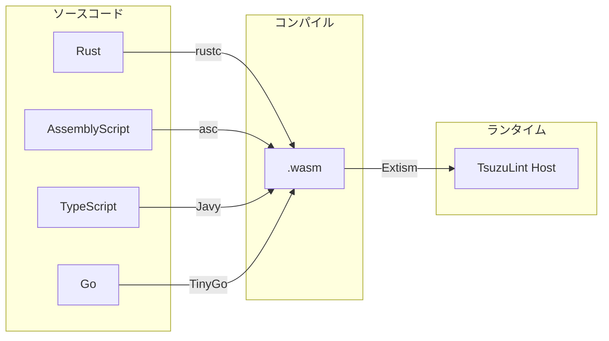
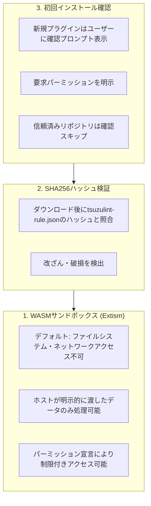
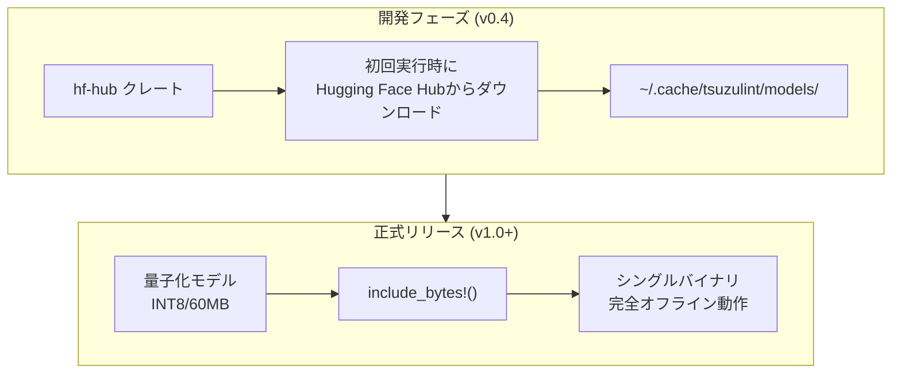
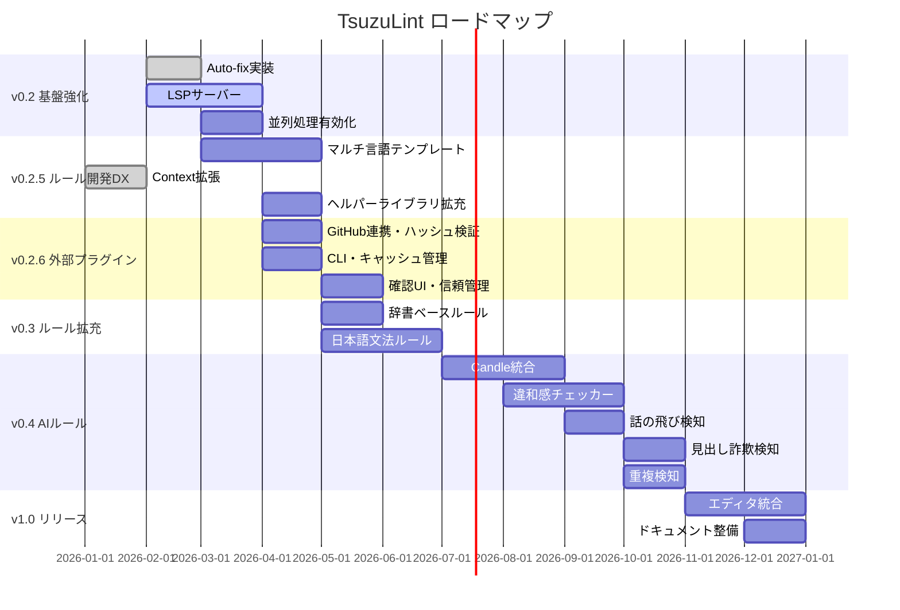

# TsuzuLint TODO・マイルストーン整理

## プロジェクト概要

TsuzuLintは、textlintにインスパイアされた高性能な自然言語リンターです。Rustで書かれ、WASMベースのルールシステムを採用しています。

## 現在の実装状況

### ✅ 実装完了

| コンポーネント | 状態 | 説明 |
| :--- | :--- | :--- |
| **tsuzulint_ast** | ✅ 完成 | Arena allocator (bumpalo)、TxtNode、Span、NodeType |
| **tsuzulint_parser** | ✅ 完成 | Markdown (markdown-rs)、PlainText パーサー |
| **tsuzulint_plugin** | ✅ 完成 | Extism (native) / wasmi (browser) のデュアルバックエンド |
| **tsuzulint_cache** | ✅ 完成 | BLAKE3ハッシュ、ファイルレベルキャッシュ |
| **tsuzulint_core** | ✅ 完成 | Linterエンジン、Config、並列処理 (rayon) |
| **tsuzulint_cli** | ✅ 完成 | lint, init, create-rule, add-rule コマンド, --fix |
| **tsuzulint_wasm** | ✅ 完成 | ブラウザ向けWASMバインディング |
| **tsuzulint_lsp** | 🚧 β版 | 初期実装完了 (診断通知, Code Actions) |
| **Plugin Loading** | 🚧 部分実装 | ローカルプラグインのロードは完成、外部配布システム（GitHub連携・ハッシュ検証等）は未実装 |

### ルール実装

| ルール | 状態 | 説明 |
| :--- | :--- | :--- |
| `no-todo` | ✅ 完成 | TODO/FIXME コメント検出 |
| `sentence-length` | ✅ 完成 | 文長チェック |
| `no-doubled-joshi` | ✅ 完成 | 日本語助詞重複検出（Fixable） |

### テンプレート

| 言語 | 状態 | 説明 |
| :--- | :--- | :--- |
| Rust | ✅ 完成 | `templates/rust/` |
| AssemblyScript | ⏳ Experimental | `templates/assemblyscript/` |

---

## フェーズ1: 基盤強化 (v0.2)

### 1.1 CLI機能完成

- [x] **Auto-fix機能の実装**
  - Diagnostic に `fix` 情報がある場合に自動修正
  - `--fix --dry-run` オプション追加

- [ ] **プラグイン管理機能**
  - 名前ベースのプラグイン解決 (`$PROJECT/.tsuzulint/plugins` -> `$HOME/.tsuzulint/plugins`)
  - `tzlint plugin install <plugin-name>` (将来実装)

- [ ] **出力フォーマット拡張**
  - SARIF形式 (GitHub Actions連携用)
  - GitHub Actions用 `::error::` フォーマット

### 1.2 LSP サーバー実装

- [x] `tower-lsp` クレートを使用したLSP実装
- [x] リアルタイム診断
- [x] コードアクション (Quick Fix) (Auto-fix対応)
- [ ] VS Code拡張プラグイン

### 1.3 パフォーマンス最適化

- [ ] **ホスト側での node_types フィルタリング**
  - 現状: `RuleManifest.node_types` はプラグイン内でのみチェック、すべてのルールにすべてのノードが渡される
  - 改善: ホスト側で事前にノードタイプをチェックし、対象外のルールはWASM呼び出し自体をスキップ
  - 効果: 不要なWASM境界越え + JSONシリアライズコストを削減
  - 実装箇所: `PluginHost::run_rule()` 内でマニフェストの `node_types` をチェック

- [ ] **バッチ処理への移行**
  - 現状: 各ノードに対して個別に `lint()` を呼び出し
  - 改善: マッチするノードを配列にまとめて1回の `lint()` 呼び出しで渡す
  - 効果: WASM呼び出しオーバーヘッド削減、`source` の重複コピー回避
  - 関連: [WASM Interface Specification](./wasm-interface.md#lintrequest)

- [ ] **インクリメンタルlint（差分lint）**
  - `cache_scope` フィールドによるキャッシュ粒度の制御
  - `node`: ノード単位でキャッシュ可能（`sentence-length` など）
  - `node_type`: 同タイプのノードが変更されたら全再lint（`no-duplicate-headers` など）
  - `document`: 何か変更されたら全再lint（`consistent-terminology` など）
  - 関連: [WASM Interface Specification](./wasm-interface.md#cache_scope-values)

- [ ] **exclude_contexts によるノードフィルタリング**
  - ホスト側で不要なノードを除外してからWASMに渡す
  - 例: `exclude_contexts: ["CodeBlock"]` でコードブロック内のノードをスキップ

- [ ] ファイル並列処理の有効化
  - 現在 `rayon` は導入済みだが、`markdown-rs` の `ParseOptions` が `Send + Sync` を実装していないため順次処理
  - 解決策: ファイルごとにパーサーインスタンスを作成

- [ ] rkyv によるゼロコピーキャッシュデシリアライズ

---

## フェーズ1.5: マルチ言語ルールサポート & 開発DX向上 (v0.2.5)

> [!IMPORTANT]
> ルールを簡単に記述できるようにすることで、コミュニティによるルール開発を促進

### 1.5.1 マルチ言語ルールサポート

現在のテンプレート:
- ✅ **Rust**: 本番推奨（`wasm32-wasip1`ターゲット）
- ⏳ **AssemblyScript**: 実験的サポート

追加予定:
- [ ] **TypeScript/JavaScript** テンプレート
  - AssemblyScript より馴染みのある構文
  - [Javy](https://github.com/bytecodealliance/javy) でWASMコンパイル

- [ ] **Go** テンプレート
  - TinyGoでWASMコンパイル

- [ ] **Python** テンプレート（将来検討）
  - [py2wasm](https://pepy.tech/project/pywasm) または Pyodide系



### 1.5.2 ルール開発DX向上

#### a) LintRequest の設計

`LintRequest` はマッチするノードをバッチ（配列）で渡す設計:

```json
{
  "nodes": [
    { "type": "Str", "range": [0, 10], "children": [] },
    { "type": "Str", "range": [20, 35], "children": [] }
  ],
  "config": {},
  "source": "Hello World. This is a test.",
  "file_path": "test.md"
}
```

- [x] **バッチ処理設計**
  - 全マッチノードを1回の `lint()` 呼び出しで渡す
  - `source` は1回だけコピー（メモリ効率向上）
  - 状態管理不要（全ノードが一度に利用可能）

#### b) 共通ヘルパーライブラリの強化

`tsuzulint-rule-pdk` クレートの拡張:

```rust
// 現在
pub fn extract_node_text(node: &Value, source: &str) -> Option<(usize, usize, &str)>;
pub fn is_node_type(node: &Value, expected: &str) -> bool;

// 追加予定
pub fn get_text(request: &LintRequest) -> &str;          // helpers.text のショートカット
pub fn get_location(request: &LintRequest) -> Location;  // helpers.location
pub fn is_in_code_block(request: &LintRequest) -> bool;  // helpers.flags.in_code_block
pub fn get_parent_type(request: &LintRequest) -> Option<&str>;
pub fn get_sentences(text: &str) -> Vec<Sentence>;       // 文分割ユーティリティ
pub fn find_all_matches(text: &str, pattern: &str) -> Vec<Match>; // パターンマッチ
```

#### c) 宣言的ルール定義（将来）

シンプルなルールは設定だけで定義できるようにする:

```json
{
  "name": "no-bad-words",
  "version": "1.0.0",
  "type": "pattern-match",
  "patterns": [
    { "match": "TODO:", "message": "TODO found", "severity": "warning" },
    { "match": "/FIXME|XXX/i", "message": "Task marker found" }
  ],
  "node_types": ["Str"],
  "skip_in": ["code_block", "code_inline"]
}
```

このJSONから自動的にWASMを生成、または組み込みルールとして処理。

---

## フェーズ1.6: 外部プラグイン配布システム (v0.2.6)

> [!IMPORTANT]
> GitHubで公開されたプラグインを簡単かつ安全にインストール・管理できるようにする

### 1.6.1 プラグイン指定形式

`.tsuzulint.jsonc` でのプラグイン指定を拡張:

```json
{
  "rules": [
    // 形式1: GitHub形式（最新バージョン）
    "simorgh3196/tsuzulint-rule-no-doubled-joshi",

    // 形式2: GitHub形式 + 固定バージョン
    "simorgh3196/tsuzulint-rule-sentence-length@1.2.0",

    // 形式3: GitHub形式 + エイリアス
    { "github": "alice/tsuzulint-rule-foo", "as": "alice-foo" },

    // 形式4: URL指定（asは必須）
    { "url": "https://example.com/rules/tsuzulint-rule.json", "as": "external" },

    // 形式5: ローカルパス（asは必須、開発用）
    { "path": "./my-rules/tsuzulint-rule.json", "as": "my-local" }
  ]
}
```

> [!NOTE]
> バージョン範囲指定（`^1.0`, `~1.0`）は採用しない。固定バージョン指定により、設定ファイル自体が再現性を保証する。
>
> `url` および `path` 形式では、ownerを特定できないため `as` フィールドが必須。

**設定ファイルの優先順位:**

両方存在する場合は `.tsuzulint.jsonc` を優先:
1. `.tsuzulint.jsonc`（デフォルト、コメント可）
2. `.tsuzulint.json`

**ルール識別子とエイリアス:**

- **短縮名**: マニフェストの `name` フィールド（例: `no-todo`, `sentence-length`）
- **エイリアス**: `as` で明示指定

**エイリアスの使用:**

基本的には短縮名を使用、競合時や明示的に指定したい場合は `as` を使用:

```json
{
  "rules": [
    { "github": "alice/tsuzulint-rule-sentence-length", "as": "alice-sl" },
    { "github": "bob/tsuzulint-rule-sentence-length", "as": "bob-sl" },
    { "path": "./local-rules/my-rule", "as": "my-local" }
  ],
  "options": {
    "alice-sl": { "max": 100 },
    "bob-sl": { "max": 80 },
    "my-local": { "enabled": true }
  }
}
```

**解決優先順位:**
1. `as` が指定されている場合はそのエイリアスを使用
2. 競合がなければ短縮名を使用
3. 競合があり `as` もない場合は**エラー**

競合時のエラーメッセージ:

```text
Error: Rule name "sentence-length" is ambiguous:
   - alice/tsuzulint-rule-sentence-length
   - bob/tsuzulint-rule-sentence-length
   Use 'as' to specify unique aliases for each rule.
```

### 1.6.2 プラグインスペックファイル（tsuzulint-rule.json）

プラグイン作者がリポジトリに配置する必須ファイル。JSON Schema による補完・検証が可能:

```json
{
  "$schema": "https://raw.githubusercontent.com/simorgh3196/tsuzulint/main/schemas/v1/rule.json",
  "rule": {
    "name": "no-doubled-joshi",
    "version": "1.0.0",
    "description": "日本語助詞の重複を検出するルール",
    "repository": "https://github.com/simorgh3196/tsuzulint-rule-no-doubled-joshi",
    "license": "MIT",
    "authors": ["Author Name <email@example.com>"]
  },
  "artifacts": {
    "wasm": "https://github.com/.../releases/download/v{version}/rule.wasm",
    "sha256": "a1b2c3d4e5f6..."
  },
  "tsuzulint": {
    "min_version": "0.2.0"
  }
}
```

> **Note**: Runtime configuration (`fixable`, `node_types`, `cache_scope`, `exclude_contexts`) is defined in WASM via `get_manifest()`. See [WASM Interface Specification](./wasm-interface.md#rulemanifest).

**DXの利点:**
- `$schema` 指定でVSCode等の補完・バリデーションが自動で効く
- ホバーで各フィールドの説明を表示
- 保存時に型チェック・必須フィールドチェック

**スキーマバージョニング:**
- URL形式: `schemas/v{major}/rule.json`（例: `schemas/v1/rule.json`）
- 後方互換性のない変更（必須フィールド追加、フィールド削除等）でメジャーバージョンを上げる
- 後方互換性のある変更（オプショナルフィールド追加等）は同一バージョン内で更新
- 旧バージョンのスキーマは非推奨化後も一定期間維持

### 1.6.3 セキュリティ設計



**信頼管理（リポジトリ単位）:**
- 初回インストール時に確認ダイアログを表示
- 「Trust this repository」を選択すると、以降そのリポジトリは確認なしでインストール/アップデート
- 信頼リストは `~/.tsuzulint/trust.json` に保存

### 1.6.4 パーミッションシステム（将来拡張）

プラグインが追加の機能を必要とする場合、マニフェストで宣言:

```json
{
  "permissions": {
    "filesystem": [
      { "path": "~/.tsuzulint/dictionaries/", "access": "read" },
      { "path": "~/.tsuzulint/dictionaries/user-terms.txt", "access": "write" }
    ]
  }
}
```

将来の拡張（優先度低）:

```json
{
  "permissions": {
    "network": [
      { "host": "api.example.com", "access": "https" }
    ]
  }
}
```

**パーミッションの種類:**

| パーミッション | 説明 | 優先度 |
| :--- | :--- | :--- |
| `filesystem.read` | 指定パスからの読み取り | 高（辞書ルール用） |
| `filesystem.write` | 指定パスへの書き込み | 中（学習辞書用） |
| `network` | 外部API呼び出し | 低（将来検討） |

**インストール時の確認:**

```text
╭──────────────────────────────────────────────────────────────────╮
│ New plugin installation                                          │
├──────────────────────────────────────────────────────────────────┤
│ Plugin: simorgh3196/tsuzulint-rule-custom-dict                      │
│ Version: 1.0.0                                                   │
│                                                                  │
│ ⚠️  This plugin requests additional permissions:                 │
│                                                                  │
│   📁 Read: ~/.tsuzulint/dictionaries/                               │
│   📝 Write: ~/.tsuzulint/dictionaries/user-terms.txt                │
│                                                                  │
│ [T]rust this repository | [I]nstall once | [C]ancel              │
╰──────────────────────────────────────────────────────────────────╯
```

**ホスト側の実装:**
- Extismのホスト関数として `read_file()`, `write_file()` を提供
- マニフェストで宣言されたパス以外へのアクセスは拒否
- パス正規化によるディレクトリトラバーサル攻撃を防止

### 1.6.5 CLIコマンド

```bash
# プラグインのインストール
tzlint plugin install simorgh3196/tsuzulint-rule-no-doubled-joshi
tzlint plugin install simorgh3196/tsuzulint-rule-foo@1.2.0
tzlint plugin install --yes ...  # 確認スキップ（CI用）

# プラグイン一覧・アップデート
tzlint plugin list
tzlint plugin list --outdated
tzlint plugin update

# 信頼管理（リポジトリ単位）
tzlint plugin trust add simorgh3196/tsuzulint-rule-foo
tzlint plugin trust list
tzlint plugin trust remove simorgh3196/tsuzulint-rule-foo
```

**`plugin install` の動作詳細:**

1. `.tsuzulint.jsonc` が存在しない場合、テンプレートから自動生成
2. `rules` 配列にルール宣言を追加
3. `get_manifest()` から返されるマニフェストの設定スキーマを取得

```bash
# 例: 初回インストール
tsuzulint plugin install simorgh3196/tsuzulint-rule-sentence-length
```

生成される `.tsuzulint.jsonc`:

```json
{
  "$schema": "https://raw.githubusercontent.com/simorgh3196/tsuzulint/main/schemas/v1/config.json",
  "rules": [
    "simorgh3196/tsuzulint-rule-sentence-length"
  ],
  "options": {
    "sentence-length": {
      "max": 100,
      "min": 0
    }
  }
}
```

**将来拡張（LSP統合）:**
- LSPサーバーがインストール済みプラグインのスキーマを動的に認識
- `.tsuzulint.jsonc` 編集時にプラグイン固有オプションの補完・バリデーションを提供
- プラグインアップデート時に新オプションを自動提案

### 1.6.6 設定ファイルスキーマ

`.tsuzulint.jsonc` 用のJSON Schema（`schemas/v1/config.json`）:
- 基本フィールド（`rules`, `options`, `security`等）の補完・バリデーション
- `options` セクションは `additionalProperties: true` でルール固有オプションを許容
- 将来的にLSPで動的補完に移行

### 1.6.7 新規クレート構成

```text
crates/
└── tsuzulint_registry/        # NEW: プラグイン解決・取得・セキュリティ
    ├── resolver.rs         # GitHub/URL/Local の解析
    ├── source.rs           # ダウンロード・キャッシュ
    ├── manifest.rs         # tsuzulint-rule.json パース
    ├── hash.rs             # SHA256検証
    ├── trust.rs            # 信頼済みリポジトリ管理
    └── permissions.rs      # パーミッション検証・ホスト関数
```

### 1.6.8 依存クレート

```toml
# Cargo.toml への追加
reqwest = { version = "0.12", features = ["rustls-tls", "json"] }
semver = "1.0"
serde_json = "1.0"  # tsuzulint-rule.json パース
jsonschema = "0.18" # スキーマ検証
sha2 = "0.10"
```

---

## フェーズ2: ルール拡充 (v0.3)

### 2.1 辞書ベースルール（高速・確実）

> [!TIP]
> 辞書マッチングはAIよりも圧倒的に速く、100%正確。Rustの高速Trie木/Aho-Corasick法で実装。

- [ ] **用語統一ルール**
  - `Product ID` vs `ProductID` 等の表記揺れ検出
  - カスタム辞書ファイルサポート
  - Aho-Corasickによる複数パターン高速マッチング

- [ ] **禁止語ルール**
  - NG ワードリストによる検出
  - プロジェクト固有の用語規則

### 2.2 文法・スタイルルール

- [ ] **日本語文法ルール**
  - ら抜き言葉検出
  - 二重否定検出
  - 敬語の混在検出

- [ ] **マークダウンスタイルルール**
  - 見出しレベルスキップ検出
  - リンク切れ検出
  - 画像altテキスト必須

---

## フェーズ3: AIベースルール (v0.4+)

> [!IMPORTANT]
> これらは「辞書では作れない」かつ「ベクトル（意味）と確率（推論）」を使うからこそ実現できるルールです。

### 3.1 モデル配布戦略



**推奨モデル:**
- `multilingual-e5-small` (Apache 2.0) - 文埋め込み
- BERTベースの日本語モデル (Apache 2.0) - Masked LM
- `cl100k_base` tokenizer - テキスト分割

### 3.2 違和感チェッカー (Perplexity/確率スコア)

> 「この日本語、なんか変だ」という違和感を数値化

**仕組み:**
- Masked Language Model (BERT系) を使用
- 文章全体の出現確率（尤度）を計算
- 極端にスコアが低い箇所を検出

**検出例:**

```text
❌ ユーザー「を」ログインします  → 「が」が自然
❌ サーバーを「起勤」する        → 「起動」の誤字
```

**実装計画:**
- [ ] Candleクレートによる推論エンジン統合
- [ ] 日本語BERTモデル (cl-tohoku/bert-base-japanese) サポート
- [ ] Perplexityスコア閾値の調整オプション

### 3.3 話の飛び検知 (Coherence Check)

> 文章の「つながりの悪さ」を指摘

**仕組み:**
- 前文と後文のベクトルを計算
- コサイン類似度が急落した箇所を検出
- 接続詞の欠如や話題の唐突な変化を警告

**検出例:**

```text
❌ このAPIはJSONを返します。お昼ご飯はカレーでした。
   → 文脈スコア急降下：「論理のつながりが希薄です」
```

**実装計画:**
- [ ] 文単位のEmbedding計算
- [ ] スライディングウィンドウによる類似度計算
- [ ] 章・セクション境界の自動検出

### 3.4 見出し詐欺検知 (Zero-shot Classification)

> 見出しと内容の不一致を防ぐ

**仕組み:**
- Zero-shot Classificationで段落を分類
- 定義ラベル: `["手順", "概念", "注意", "例示", "その他"]`
- 見出しタイプと内容カテゴリの照合

**検出例:**

```markdown
> [!WARNING]
> 今日はいい天気ですね。  ← 警告ブロックに警告内容がない

## インストール手順
概念的な説明が続く...  ← 「手順」なのにコマンドがない
```

**実装計画:**
- [ ] ラベルセットのカスタマイズ
- [ ] Markdownブロック種別との照合ロジック
- [ ] 信頼度スコアの閾値設定

### 3.5 情報の重複検知 (Semantic Deduplication)

> 離れた場所で「同じことを言っている」冗長な記述を発見

**仕組み:**
- 全段落をベクトル化してメモリに格納
- 総当たりで類似度比較 (閾値: 0.95以上)
- 表現は違うが意味が同じペアを検出

**検出例:**

```text
P.1: APIキーは設定画面から取得できます
P.10: 設定画面に行くとAPIキーが入手可能です
→ 「ほぼ同じ説明です。共通項として切り出しませんか？」
```

**実装計画:**
- [ ] 段落レベルのEmbeddingキャッシュ
- [ ] 高速な類似度検索 (FAISS or hnswlib)
- [ ] 重複ペアのグルーピングとレポート

---

## フェーズ4: エコシステム (v1.0)

### 4.1 エディタ統合

- [ ] VS Code拡張
- [ ] JetBrains IDE プラグイン
- [ ] Neovim LSP設定例

### 4.2 CI/CD統合

- [ ] GitHub Action公式配布
- [ ] Pre-commit hook
- [ ] GitLab CI テンプレート

### 4.3 ドキュメント・コミュニティ

- [ ] 公式ドキュメントサイト
- [ ] ルールカタログ
- [ ] textlint移行ガイド拡充

---

## 技術的考慮事項

### AIモデルのライセンス

使用予定のモデルはすべて **Apache 2.0 / MIT** ライセンスで再配布可能：
- BERT, RoBERTa, E5
- cl-tohoku/bert-base-japanese
- multilingual-e5-small

著作権表示を含めれば商用利用・再配布OK。

### 推奨技術スタック

```toml
# Cargo.toml (将来追加)
[dependencies]
# AI推論
candle-core = "0.4"
candle-transformers = "0.4"
tokenizers = "0.15"

# モデルダウンロード
hf-hub = "0.3"

# 高速文字列マッチング
aho-corasick = "1.1"

# マルチ言語ルールサポート
javy = "2.0"  # TypeScript → WASM
```

---

## まとめ: ロードマップ



## 次のアクション

1. **優先**: LSPサーバーの機能拡充 (VSCode拡張の開発)
2. **優先**: 並列処理の有効化 (markdown-rs の Send/Sync 問題解決)
3. **重要**: 外部プラグイン配布システム (tsuzulint_registry クレート)
4. **調査必要**: Javy (TypeScript → WASM) の実用性検証
5. **準備**: AIベースルールのPoC作成
