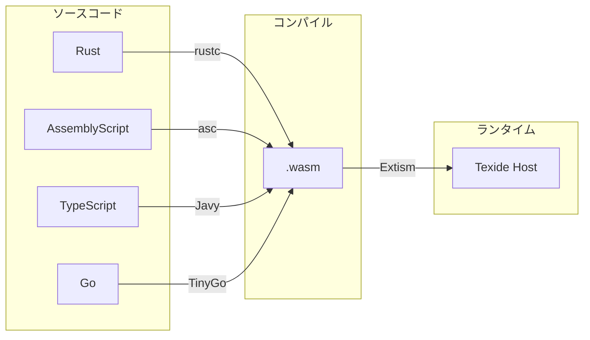
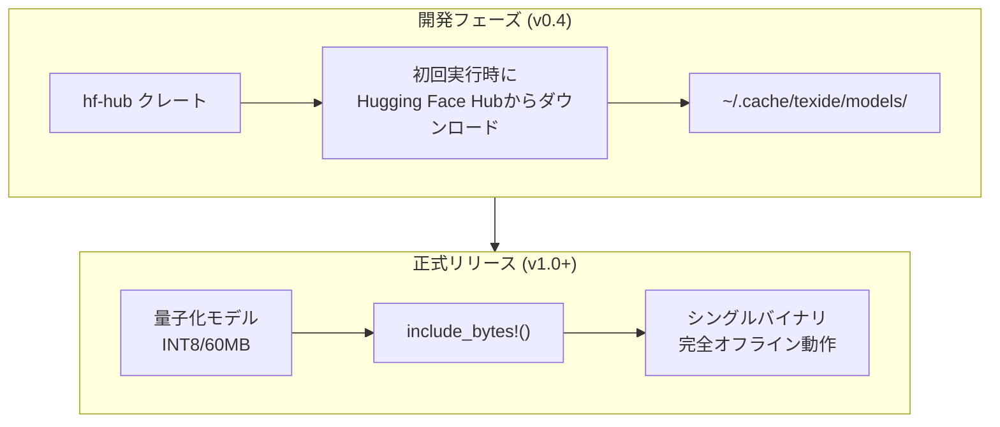
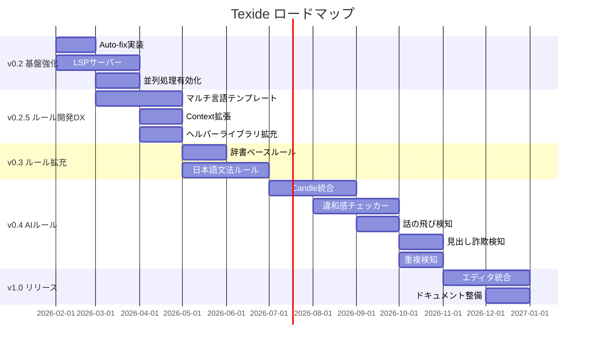

# Texide TODO・マイルストーン整理

## プロジェクト概要

Texideは、textlintにインスパイアされた高性能な自然言語リンターです。Rustで書かれ、WASMベースのルールシステムを採用しています。

## 現在の実装状況

### ✅ 実装完了

| コンポーネント | 状態 | 説明 |
|--------------|------|------|
| **texide_ast** | ✅ 完成 | Arena allocator (bumpalo)、TxtNode、Span、NodeType |
| **texide_parser** | ✅ 完成 | Markdown (markdown-rs)、PlainText パーサー |
| **texide_plugin** | ✅ 完成 | Extism (native) / wasmi (browser) のデュアルバックエンド |
| **texide_cache** | ✅ 完成 | BLAKE3ハッシュ、ファイルレベルキャッシュ |
| **texide_core** | ✅ 完成 | Linterエンジン、Config、並列処理 (rayon) |
| **texide_cli** | ✅ 完成 | lint, init, create-rule, add-rule コマンド |
| **texide_wasm** | ✅ 完成 | ブラウザ向けWASMバインディング |

### ⏳ 未実装・プレースホルダ

| コンポーネント | 状態 | 説明 |
|--------------|------|------|
| **texide_lsp** | ⏳ 未実装 | プレースホルダのみ存在 |
| **--fix オプション** | ⏳ 未実装 | CLI引数は存在するが機能していない |

### ルール実装

| ルール | 状態 | 説明 |
|--------|------|------|
| `no-todo` | ✅ 完成 | TODO/FIXME コメント検出 |
| `sentence-length` | ✅ 完成 | 文長チェック |
| `no-doubled-joshi` | ✅ 完成 | 日本語助詞重複検出（Fixable） |

### テンプレート

| 言語 | 状態 | 説明 |
|------|------|------|
| Rust | ✅ 完成 | `templates/rust/` |
| AssemblyScript | ⏳ Experimental | `templates/assemblyscript/` |

---

## フェーズ1: 基盤強化 (v0.2)

### 1.1 CLI機能完成

- [ ] **Auto-fix機能の実装**
  - Diagnostic に `fix` 情報がある場合に自動修正
  - `--fix --dry-run` オプション追加

- [ ] **出力フォーマット拡張**
  - SARIF形式 (GitHub Actions連携用)
  - GitHub Actions用 `::error::` フォーマット

### 1.2 LSP サーバー実装

- [ ] `tower-lsp` クレートを使用したLSP実装
- [ ] リアルタイム診断
- [ ] コードアクション (Quick Fix)
- [ ] VS Code拡張プラグイン

### 1.3 パフォーマンス最適化

- [ ] ファイル並列処理の有効化
  - 現在 `rayon` は導入済みだが、`markdown-rs` の `ParseOptions` が `Send + Sync` を実装していないため順次処理
  - 解決策: ファイルごとにパーサーインスタンスを作成

- [ ] 行レベルインクリメンタルキャッシュ
- [ ] rkyv によるゼロコピーキャッシュデシリアライズ

---

## フェーズ1.5: マルチ言語ルールサポート & 開発DX向上 (v0.2.5)

> [!IMPORTANT]
> ルールを簡単に記述できるようにすることで、コミュニティによるルール開発を促進

### 1.5.1 マルチ言語ルールサポート

現在のテンプレート:
- ✅ **Rust**: 本番推奨（`wasm32-wasip1`ターゲット）
- ⏳ **AssemblyScript**: 実験的サポート

追加予定:
- [ ] **TypeScript/JavaScript** テンプレート
  - AssemblyScript より馴染みのある構文
  - [Javy](https://github.com/bytecodealliance/javy) でWASMコンパイル

- [ ] **Go** テンプレート
  - TinyGoでWASMコンパイル

- [ ] **Python** テンプレート（将来検討）
  - [py2wasm](https://pepy.tech/project/pywasm) または Pyodide系



### 1.5.2 ルール開発DX向上

#### a) LintContext の拡張

現在の `LintRequest`:
```json
{
  "node": { "type": "Str", "range": [0, 10] },
  "config": {},
  "source": "Hello World",
  "file_path": "test.md"
}
```

**拡張案: よくある処理の事前計算情報を追加**

```json
{
  "node": { "type": "Str", "range": [0, 10] },
  "config": {},
  "source": "Hello World",
  "file_path": "test.md",

  // 📌 NEW: ヘルパー情報
  "helpers": {
    // ノードのテキスト（事前抽出）
    "text": "Hello World",

    // 位置情報（行・列）
    "location": {
      "start": { "line": 1, "column": 1 },
      "end": { "line": 1, "column": 12 }
    },

    // 前後のコンテキスト
    "context": {
      "previous_node_type": null,
      "next_node_type": "Paragraph",
      "parent_node_type": "Document",
      "depth": 1
    },

    // 文脈判定フラグ
    "flags": {
      "in_code_block": false,
      "in_heading": false,
      "in_list": false,
      "in_blockquote": false,
      "in_link": false
    }
  }
}
```

#### b) 共通ヘルパーライブラリの強化

`texide-rule-common` クレートの拡張:

```rust
// 現在
pub fn extract_node_text(node: &Value, source: &str) -> Option<(usize, usize, &str)>;
pub fn is_node_type(node: &Value, expected: &str) -> bool;

// 追加予定
pub fn get_text(request: &LintRequest) -> &str;          // helpers.text のショートカット
pub fn get_location(request: &LintRequest) -> Location;  // helpers.location
pub fn is_in_code_block(request: &LintRequest) -> bool;  // helpers.flags.in_code_block
pub fn get_parent_type(request: &LintRequest) -> Option<&str>;
pub fn get_sentences(text: &str) -> Vec<Sentence>;       // 文分割ユーティリティ
pub fn find_all_matches(text: &str, pattern: &str) -> Vec<Match>; // パターンマッチ
```

#### c) 宣言的ルール定義（将来）

シンプルなルールは設定だけで定義できるようにする:

```json
{
  "name": "no-bad-words",
  "version": "1.0.0",
  "type": "pattern-match",
  "patterns": [
    { "match": "TODO:", "message": "TODO found", "severity": "warning" },
    { "match": "/FIXME|XXX/i", "message": "Task marker found" }
  ],
  "node_types": ["Str"],
  "skip_in": ["code_block", "code_inline"]
}
```

このJSONから自動的にWASMを生成、または組み込みルールとして処理。

---

## フェーズ2: ルール拡充 (v0.3)

### 2.1 辞書ベースルール（高速・確実）

> [!TIP]
> 辞書マッチングはAIよりも圧倒的に速く、100%正確。Rustの高速Trie木/Aho-Corasick法で実装。

- [ ] **用語統一ルール**
  - `Product ID` vs `ProductID` 等の表記揺れ検出
  - カスタム辞書ファイルサポート
  - Aho-Corasickによる複数パターン高速マッチング

- [ ] **禁止語ルール**
  - NG ワードリストによる検出
  - プロジェクト固有の用語規則

### 2.2 文法・スタイルルール

- [ ] **日本語文法ルール**
  - ら抜き言葉検出
  - 二重否定検出
  - 敬語の混在検出

- [ ] **マークダウンスタイルルール**
  - 見出しレベルスキップ検出
  - リンク切れ検出
  - 画像altテキスト必須

---

## フェーズ3: AIベースルール (v0.4+)

> [!IMPORTANT]
> これらは「辞書では作れない」かつ「ベクトル（意味）と確率（推論）」を使うからこそ実現できるルールです。

### 3.1 モデル配布戦略



**推奨モデル:**
- `multilingual-e5-small` (Apache 2.0) - 文埋め込み
- BERTベースの日本語モデル (Apache 2.0) - Masked LM
- `cl100k_base` tokenizer - テキスト分割

### 3.2 違和感チェッカー (Perplexity/確率スコア)

> 「この日本語、なんか変だ」という違和感を数値化

**仕組み:**
- Masked Language Model (BERT系) を使用
- 文章全体の出現確率（尤度）を計算
- 極端にスコアが低い箇所を検出

**検出例:**
```text
❌ ユーザー「を」ログインします  → 「が」が自然
❌ サーバーを「起勤」する        → 「起動」の誤字
```

**実装計画:**
- [ ] Candleクレートによる推論エンジン統合
- [ ] 日本語BERTモデル (cl-tohoku/bert-base-japanese) サポート
- [ ] Perplexityスコア閾値の調整オプション

### 3.3 話の飛び検知 (Coherence Check)

> 文章の「つながりの悪さ」を指摘

**仕組み:**
- 前文と後文のベクトルを計算
- コサイン類似度が急落した箇所を検出
- 接続詞の欠如や話題の唐突な変化を警告

**検出例:**
```text
❌ このAPIはJSONを返します。お昼ご飯はカレーでした。
   → 文脈スコア急降下：「論理のつながりが希薄です」
```

**実装計画:**
- [ ] 文単位のEmbedding計算
- [ ] スライディングウィンドウによる類似度計算
- [ ] 章・セクション境界の自動検出

### 3.4 見出し詐欺検知 (Zero-shot Classification)

> 見出しと内容の不一致を防ぐ

**仕組み:**
- Zero-shot Classificationで段落を分類
- 定義ラベル: `["手順", "概念", "注意", "例示", "その他"]`
- 見出しタイプと内容カテゴリの照合

**検出例:**
```markdown
> [!WARNING]
> 今日はいい天気ですね。  ← 警告ブロックに警告内容がない

## インストール手順
概念的な説明が続く...  ← 「手順」なのにコマンドがない
```

**実装計画:**
- [ ] ラベルセットのカスタマイズ
- [ ] Markdownブロック種別との照合ロジック
- [ ] 信頼度スコアの閾値設定

### 3.5 情報の重複検知 (Semantic Deduplication)

> 離れた場所で「同じことを言っている」冗長な記述を発見

**仕組み:**
- 全段落をベクトル化してメモリに格納
- 総当たりで類似度比較 (閾値: 0.95以上)
- 表現は違うが意味が同じペアを検出

**検出例:**
```text
P.1: APIキーは設定画面から取得できます
P.10: 設定画面に行くとAPIキーが入手可能です
→ 「ほぼ同じ説明です。共通項として切り出しませんか？」
```

**実装計画:**
- [ ] 段落レベルのEmbeddingキャッシュ
- [ ] 高速な類似度検索 (FAISS or hnswlib)
- [ ] 重複ペアのグルーピングとレポート

---

## フェーズ4: エコシステム (v1.0)

### 4.1 エディタ統合

- [ ] VS Code拡張
- [ ] JetBrains IDE プラグイン
- [ ] Neovim LSP設定例

### 4.2 CI/CD統合

- [ ] GitHub Action公式配布
- [ ] Pre-commit hook
- [ ] GitLab CI テンプレート

### 4.3 ドキュメント・コミュニティ

- [ ] 公式ドキュメントサイト
- [ ] ルールカタログ
- [ ] textlint移行ガイド拡充

---

## 技術的考慮事項

### AIモデルのライセンス

使用予定のモデルはすべて **Apache 2.0 / MIT** ライセンスで再配布可能：
- BERT, RoBERTa, E5
- cl-tohoku/bert-base-japanese
- multilingual-e5-small

著作権表示を含めれば商用利用・再配布OK。

### 推奨技術スタック

```toml
# Cargo.toml (将来追加)
[dependencies]
# AI推論
candle-core = "0.4"
candle-transformers = "0.4"
tokenizers = "0.15"

# モデルダウンロード
hf-hub = "0.3"

# 高速文字列マッチング
aho-corasick = "1.1"

# マルチ言語ルールサポート
javy = "2.0"  # TypeScript → WASM
```

---

## まとめ: ロードマップ



## 次のアクション

1. **即座に着手可能**: Auto-fix機能の実装
2. **並行作業可能**: LSPサーバーのスケルトン作成
3. **設計検討**: LintRequest の `helpers` フィールド設計
4. **調査必要**: Javy (TypeScript → WASM) の実用性検証
5. **調査必要**: Candleクレートによる推論パフォーマンス検証
